# Sherpa-UI — How It All Ties Together

A single diagram of the whole system: **Figma → Tokens → CSS → HTML/JS components → JSDoc → MCP → Skills → Agents/Apps**, including the generative-UI validation loop.

> Paste the fenced `mermaid` block into Obsidian (renders natively) or FigJam (Add → Mermaid). If FigJam rejects the `%%{init}%%` theme block, delete that first line and it still renders (without the custom palette).

```mermaid
%%{init: {'theme':'base','themeVariables':{
  'fontFamily':'Inter, sans-serif',
  'primaryColor':'#eef2ff','primaryBorderColor':'#3c5edd','primaryTextColor':'#1a1a2e',
  'lineColor':'#8890b5','clusterBkg':'#f7f8fc','clusterBorder':'#c0c6e0'
}}}%%
flowchart LR

  subgraph DESIGN["🎨 Design source of truth"]
    direction TB
    FIGMA["Apex 2.0 Core — Figma Library\n20 collections · 1,036 variables\n5 themes × Light/Dark · Density · Layout"]
  end

  subgraph TOKENS["🎟️ Token pipeline (build-time · config-driven · scripts/)"]
    direction TB
    EXTRACT["extract-figma-vars.js\n(tokens:extract) → figma-variables.json"]
    CONFIG["figma-config.json + token-overrides.json\n(themes · breakpoints · extraAliases ·\nstatusPropMap · themeCorrections)"]
    GEN["generate-css-tokens.js\n(tokens:generate) — one pass:\nprimitives · alias · platform · themes ·\noverrides · index.css cascade"]
    FALLBACK["inject-css-fallbacks.js\n(hardcoded var() fallbacks)"]
    DIFF["diff-tokens.js\n(tokens:diff → figma-token-diff-report.md)"]
    EXTRACT --> DIFF --> GEN
    CONFIG --> GEN --> FALLBACK
  end

  subgraph CSS["🧵 CSS token tiers & layers (css/styles/)"]
    direction TB
    PRIM["primitives.css\n--core-*  (tier 1 · never used directly)"]
    ALIAS["sherpa-alias.css\n--sherpa-*  (tier 2 · always w/ fallback)"]
    PLAT["sherpa-platform.css\nhand/config constants:\nz-index · focus ring · backdrop ·\ncontent widths · color-scheme (data-mode)\n⚠ font weights + motion: no generator source yet\n(breakpoints now from token-overrides.json)"]
    THEME["sherpa-themes.css\napex-2-core/blue/purple/teal · classic\nlight / dark / hc"]
    OVER["sherpa-overrides.css (density+status)\nsherpa-brand-status.css"]
    FUNerr["sherpa-functions.css\n@function: transition/alpha/shadow/focus"]
    LAYERS["@layer: reset→primitives→alias→\nplatform→theme→overrides→components→utilities"]
    PRIM --> ALIAS --> THEME --> OVER
    PLAT --> ALIAS
    LAYERS -.governs.- ALIAS
  end

  subgraph COMP["🧩 Component (3-file split · components/sherpa-*/)"]
    direction TB
    HTML["sherpa-x.html\n&lt;template&gt; · slots (data-accepts) · cloning prototypes"]
    STYLE["sherpa-x.css\nvariants · states · visibility · @container"]
    TS["sherpa-x.ts\nlifecycle · events · attr coordination"]
    JSDOC["JSDoc header\n@attr @fires @slot @method"]
    TS -.documented by.- JSDOC
  end

  subgraph BASE["⚙️ SherpaElement base + utilities (runtime)"]
    direction TB
    SE["SherpaElement\ntemplate fetch+cache · shadow DOM\nslot detection (data-has-*) · $()/$$()\nslot validation (tier + data-accepts)"]
    ADOPT["adoptedStyleSheets ← sharedStyles:\nbase, anchor, text/icon/motion, sherpa-functions"]
    APIIN["Data-in:\n• data-* (scalar or JSON)\n• slotted light-DOM (data-accepts)\n• setData()/setSteps()\n• data-src-html / data-src-json"]
    APIOUT["Data-out:\nemit(name, detail) → CustomEvent\n(bubbles + composed)"]
    SE --> ADOPT & APIIN & APIOUT
  end

  subgraph PAT["🧱 Patterns (patterns/)"]
    direction TB
    PIDX["index.json\n(extract-pattern-index.js)"]
    PFLOW["flows/*.json + *.html\npresentation.components tree"]
    PLAY["layouts/ · feedback/"]
    PIDX --- PFLOW
    PIDX --- PLAY
  end

  subgraph MCP["🔌 MCP server (mcp-server/)"]
    direction TB
    SERVER["index.js → server.js\ntools · resources · prompts"]
    PARSER["schema-parser.js\nJSDoc → schema (attrs/slots/@fires/enums)"]
    TOOLS["23 tools:\nquery/list/generate_component ·\nbrowse_tokens · get_pattern ·\ncompose_view · validate_usage · search_api"]
    RES["sherpa:// resources (250+)"]
    PROMPTS["4 prompts"]
    GENV["generators.js + validation.js\nJSON tree → HTML · validate_usage"]
    SERVER --> TOOLS & RES & PROMPTS
    PARSER --> TOOLS & RES
    TOOLS --> GENV
  end

  subgraph GEN8["🤖 Generative UI bridge (Phase 8 · planned)"]
    direction TB
    SCHEMA["Component-tree JSON Schema"]
    BRIDGE["Lossless HTML ⇄ JSON bridge\n(round-trip guarantee)"]
    VALID["validate_template (DOM-parsing)\nenums · required · slot data-accepts NESTING"]
    SCHEMA --> VALID
    BRIDGE --> VALID
  end

  subgraph SKILLS["📓 Agent Skills (.github/skills/)"]
    direction TB
    SK["new-component · design-tokens\ncompose-form · compose-data-view\ngenerate-crud-flow · build-app-view\nfeedback-and-states"]
  end

  subgraph OUT["🚀 Consumers"]
    direction TB
    AGENT["AI agents (Claude / Cursor / Desktop)"]
    APP["Applications (import dist/components/*)"]
    GENUI["Generative UI (runtime-authored templates)"]
  end

  FIGMA -->|"Figma variables"| EXTRACT
  FALLBACK -->|emits| PRIM & ALIAS & THEME
  GEN -->|emits index.css cascade| LAYERS
  CSS -->|"light DOM: css/styles/index.css"| APP
  ALIAS -->|"var(--sherpa-*, #hex)"| STYLE
  FUNerr -->|shared into every shadow root| ADOPT
  THEME -->|"data-theme / data-mode"| STYLE

  HTML --> SE
  STYLE --> SE
  TS --> SE
  COMP -->|"compiled TS→ES2022"| APP
  JSDOC -->|parsed| PARSER

  COMP -.composed into.-> PAT
  PAT --> TOOLS
  ALIAS -->|scanned| TOOLS
  THEME -->|scanned| TOOLS

  GENV --> BRIDGE
  JSDOC -->|"slots · data-accepts · enums"| SCHEMA
  VALID -->|"structural findings / repair"| GENV

  SK -->|invoke tools/prompts| MCP
  AGENT -->|call| MCP
  AGENT -->|follow| SKILLS
  MCP -->|"schemas · valid HTML"| AGENT
  AGENT -->|authored HTML templates| VALID
  VALID -->|validated HTML| GENUI
  GENUI -->|renders| COMP
  APP -->|instantiates| COMP

  classDef design fill:#fff0f6,stroke:#d6336c,color:#1a1a2e;
  classDef token fill:#fff9db,stroke:#e8a500,color:#1a1a2e;
  classDef css fill:#e7f5ff,stroke:#1c7ed6,color:#1a1a2e;
  classDef comp fill:#eef2ff,stroke:#3c5edd,color:#1a1a2e;
  classDef base fill:#f3f0ff,stroke:#7048e8,color:#1a1a2e;
  classDef pat fill:#e6fcf5,stroke:#0ca678,color:#1a1a2e;
  classDef mcp fill:#fff4e6,stroke:#f76707,color:#1a1a2e;
  classDef gen fill:#f8f0fc,stroke:#ae3ec9,color:#1a1a2e;
  classDef skill fill:#ebfbee,stroke:#2f9e44,color:#1a1a2e;
  classDef out fill:#e9ecef,stroke:#495057,color:#1a1a2e;

  class FIGMA design;
  class EXTRACT,CONFIG,GEN,FALLBACK,DIFF token;
  class PRIM,ALIAS,PLAT,THEME,OVER,FUNerr,LAYERS css;
  class HTML,STYLE,TS,JSDOC comp;
  class SE,ADOPT,APIIN,APIOUT base;
  class PIDX,PFLOW,PLAY pat;
  class SERVER,PARSER,TOOLS,RES,PROMPTS,GENV mcp;
  class SCHEMA,BRIDGE,VALID gen;
  class SK skill;
  class AGENT,APP,GENUI out;
```

---

## How to read it (the five spines)

1. **Design → Tokens → CSS.** Figma variables are extracted, then the **config-driven** generator (`generate-css-tokens.js`, reading `figma-config.json` + `token-overrides.json`) emits `--core-*` primitives → `--sherpa-*` aliases → themes/overrides → the `index.css` cascade, with hardcoded `var()` fallbacks injected.
2. **CSS → Component.** Tokens reach components two ways: light-DOM via `css/styles/index.css`, and **into every shadow root** via `SherpaElement.sharedStyles` + `adoptedStyleSheets`. Themes inherit through the shadow boundary via `data-theme`/`data-mode`.
3. **Component internals.** The 3-file split (HTML/CSS/TS) + JSDoc, funnelled through `SherpaElement`, which owns template caching, slot detection + validation (tier + `data-accepts`), and the data-in / data-out channels (`emit()`).
4. **JSDoc → MCP → Skills → Agents.** JSDoc parses into schemas powering the 23 tools, `sherpa://` resources, and prompts; skills orchestrate them; agents/apps consume the result.
5. **Generative loop (Phase 8, planned).** JSDoc slot/`data-accepts`/enum data feeds a component-tree JSON Schema + lossless HTML⇄JSON bridge; `validate_template` enforces structure before templates render. **HTML stays canonical; JSON is a lossless mirror.**

## Colour key
🎨 design · 🎟️ token build · 🧵 CSS · 🧩 component · ⚙️ runtime base · 🧱 patterns · 🔌 MCP · 🤖 generative UI (planned) · 📓 skills · 🚀 consumers.
