# The filter family — a review

**Written for Will**, 2026-09-25. Everything here is measured, not estimated;
every command used is given so you can re-run it.

---

---

## Ledger

Kept as the work lands. Budgets from §15.4.

| step | | budget | actual | note |
|---|---|---:|---:|---|
| 1 chip owns its KIND | ✅ | — | −129 / +118 | group and sort own their gesture; 6 methods deleted from the containers |
| 2 one derivation of the kind | ✅ | — | **+73** | 15 inference sites → 1. Buys ~250 in step 4 |
| 3a `scope` renamed three ways | ✅ | ≈ 0 | **+8** | `reach` / `rows` / `scope`. 31 call sites, 2210 tests green |
| 3b the scope registry + `debugState()` | ✅ | ≈ +40 | **+84** | registry +40, `debugState()` +26, docs the rest. 219 unit / 2209 e2e green |
| 3c-i the panel stops REACHING | ✅ | ≈ −60 | **−3** | `#barOf`, `#chipOf`, `#bars`, `#markConditioned` deleted; it reports `readings` |
| 4b-i menu owns its bodies — TOOLBAR | ✅ | ≈ −60 | **+7** | toolbar −129, menu +166. The calendar CANNOT move: it projects into the menu's header slot |
| 4b-ii the GRID uses them too | ✅ | ≈ −60 | **−57** | 13 direct reads moved; two grid templates and 81 CSS lines gone |
| 3c-ii stop BORROWING menus | ✅ | ≈ −110 | **−45** | `menuFor()` is the one def→menu builder. Borrow machinery gone; the app stops scraping the bar's shadow root |
| — 3 red tests that pre-dated it | ✅ | — | **+30** | a report is the whole answer; a `min(…,100%)` floor collapsed the bar chart to 35px; a test dispatched an event nothing emits |
| — raising carries its value; Add says where | ✅ | — | **+80** | and a `load()` race that skipped a request back to the last answer |
| — the scope rules | ✅ | — | **+83** | up open, down closed, view/component exclusive. `offer`/`fields`/`canHold`/`move`; the header offers 11 fields, not 4 |
| 4 one field-row builder | ✅ | ≈ −250 | **−21** | the budget was wrong: 4b and 3c-ii had already taken the shared half. See §7 note |
| 4c a record TIMESTAMP, and one Date filter | ✅ | ≈ +60 | **+41** | `store: { key, time }`; the source declares it a date; the header chip is "Date" over `timeField` |
| 5 collapse sort/group state | ✅ | ≈ −50 | **+2** | two sync methods → one; `asc` written by ONE owner. Found the reported bug — see §4 |
| — a group is a DATA concept | ✅ | — | **+95** | Will's ruling, §18. `source.groups()`; the grid is told, not the owner |
| 5.5 error reporting | ✅ | ≈ +80 | **+118** | ONE channel, `report()` / `onReport()`; 5 host-facing give-ups converted; 8 tests |
| 6 split `filter-state.ts` | ✅ | ≈ 0 | **+25** | 548 → 324 + 93 + 156. The +25 is two file headers; the budget was right |
| test harness §13.2 | ✅ | ≈ −400 | **−113** | `window.__mount()` in the harness page; the toolbar spec 2,799 → 2,600. The other specs' mounts are not mechanically alike |
| **arc** | | **≈ −800** | **+292** | code only; docs counted separately |

---

**Diagrams of the target architecture are in §9.** §10 answers "are we
reinventing the platform?", §11 is where this could be simpler, §12 is how a
component reaches a source, and §13 is what this review missed, §14 is error reporting, and §15 is conciseness and reuse — CONTAINED by its region, named only when a region
offers more than one.

## 1. The short version

Four components draw filters: `sherpa-quick-filter` (the chip), its toolbar,
`sherpa-filter-panel`, and `sherpa-menu`. Together they are **4,561 lines of
TypeScript** — and **6,569 lines counting their CSS and HTML**, with **6,860
lines of tests** on top. See §13, which corrects what §3 left out. The data layer under them is correct — I tested it directly and
it answers every question right. **Every filter bug in the last two days came
from two components working out the same answer separately and disagreeing.**

There is a second problem, and it is mine: over this session I added **4,351
lines and deleted 1,095** — a ratio of **4:1**. I have been writing new code
beside the old instead of replacing it. That is a large part of why the surface
keeps growing and why fixes keep reopening old bugs.

---

## 2. What a filter IS

Your taxonomy, 2026-09-25:

> Group is a thing. Sort is a thing. Boolean filters are a thing. Single select
> value filters are a thing. Multi select value filters are a thing. Compound
> Conditional filters are a thing. **Organise is not.** It's just a label on the
> screen.

Six kinds. A heading, a section, a zone, a bar or a panel is **presentation**
and must never name a kind.

**Where the code stands against that model:**

| kind | how it is spelled today | honest? |
|---|---|---|
| group | `data-kind="group"` | ✅ |
| sort | `data-kind="sort"` | ✅ |
| boolean | *no options, and no `kind`* | ❌ inferred |
| single select | `select: 'single'` | ❌ a different axis |
| multi select | `select: 'multiple'` | ❌ a different axis |
| compound conditional | `conditions: true \| 'only'` | ❌ a third axis |

Four of the six kinds are **inferred** from a combination of three unrelated
properties. That is why `#addMenu` is 141 lines: it is a decision tree
rebuilding the kind from its symptoms every time it runs.

---

## 3. The numbers

```
node scripts/…/methods.mjs src/components/<name>/<name>.ts
```

| file | lines | methods | lines in methods |
|---|---:|---:|---:|
| `sherpa-quick-filter-toolbar.ts` | **1,857** | 77 | 1,367 |
| `sherpa-menu.ts` | 1,103 | — | — |
| `sherpa-filter-panel.ts` | **898** | 44 | 638 |
| `sherpa-quick-filter.ts` | 703 | — | — |

The five largest methods in the two containers:

| lines | method | what it does |
|---:|---|---|
| 141 | `toolbar #addMenu` | build a field's menu — every kind, every op |
| 109 | `panel #draw` | build every scope |
| 106 | `panel #drawField` | build one field's row |
| 86 | `toolbar #render` | build every chip |
| 54 | `panel #flipCondition` | switch one field into condition mode |

`#addMenu` + `#render` (227 lines) and `#drawField` + `#drawChip` + `#draw`
(251 lines) are **the same job twice**: turn a filter definition into controls.

---

## 4. The intertwining of Group and Sort

You asked about this directly. Sort state is read or written at **61 sites**:

```
grep -rnE "sortField|sortDirection|data-sort-|setSort|resumeSort|clearSort|nextSort|'sort'" …
```

| file | sites |
|---|---:|
| `sherpa-quick-filter-toolbar.ts` | 15 |
| `sherpa-data-grid.ts` | 13 |
| `sherpa-filter-panel.ts` | 9 |
| `data-source.ts` | 8 |
| `sherpa-quick-filter.ts` | 7 |
| `records.js` | 5 |
| `cycle.ts` | 4 |

**One value, seven owners.** And the value is spread over four separate
attributes that must agree: `data-sort-field`, `data-sort-direction`,
`data-current` on the chip, and `data-direction` on the chip. Group has three.

The asymmetries this has already produced:

- `#syncSortLabel` kept the column when the chip went off; `#syncGroupLabel`,
  four methods away, blanked it. Group forgot what Sort remembered.
- `data-direction` is written `'asc'` unconditionally in three places
  (`#renderOrganise`, `#syncSortFromAttrs`, the chip's own cycle), so "which
  way" and "is it running" are carried by different attributes that no single
  function owns.
- Group and Sort share one `.field-values` container in the panel and are both
  `select: 'single'`, so the "untick the siblings" sweep cleared the other one.

### 4.1 FOUND IT — 2026-09-25, after step 5

Reproduced on the running page. It is **two** things, and only one is a bug.

**Last Seen is the `mine` VIEW's own sort.** `examples/contexts/records-views.js`
line 33: `sort: [{ field: 'lastSeen', direction: 'desc' }]`. On
`?context=records&view=mine` the Sort chip reads "Last seen" from a fresh load,
before anyone touches it. Nothing is wrong — the view owns its arrangement —
but a reader who never chose it reads it as "Sort was applied Last Seen".

**The bug is the chip that is OFF and still names a column.** Measured:

    1 view=mine    sort: ON  "Last seen"   group: off ""
    2 grouped      sort: ON  "Last seen"   group: ON  "Customer"
    3 RELOADED     sort: ON  "Last seen"   group: off "Customer"

Line 3: the reader grouped by Customer, reloaded, and the chip says **Customer
while being off**. The view's snapshot carries `group: null`, so restoring it
ungroups — correct — but `T-off-is-not-forgotten` keeps the column, and the
caret announces a column that is not in force. The same shape on Sort:

    off   {"on":false,"icon":"sort-none","caret":"Last seen"}

A `sort-none` glyph and a neutral face, next to the words "Last seen". That is
what the report was looking at.

**RULED, 2026-09-25 — this is correct, not a bug.** Will: *"An off chip should
still show it's value. That applies to all chips regardless of purpose. Value
is only hidden when it is cleared to none/null."*

So both halves of the report are settled behaviour. Measured after the ruling,
on the `plan` chip with Free and Pro applied then switched off:

    ON   caret="Free…" count=2  bg #F2DFFF  border #C046FF   pages=2
    off  caret="Free…" count=2  bg #E8E8F6  border #B3B3C3   pages=4

The filter stops and the answer stays. On and off are told apart by the
surface, which they clearly are. `T-off-is-not-forgotten` carries the rule.

**And a correction of my own.** I first reported that applying two values left
the chip off with no filter running. It does not. My probe set
`input.checked = true` directly, which bypasses the commit menu's pending
bookkeeping, so Apply had nothing to commit. Real clicks apply correctly. Same
lesson as the page-size incident in §8 rule 4: drive the control, do not poke
its parts.

---

## 5. Why the bugs keep coming back

Every filter bug reported over two days, against its structural cause:

| symptom | cause |
|---|---|
| amber Sort chip | `data-current` written from 26 places; the chip judged itself from a menu it does not own |
| Group off cleared its column | two hosts painted the chip and disagreed |
| Sort off also killed Group | a container swept a run holding two different controls |
| menus dead after leaving the panel | the borrower did not give them back on close |
| conditional chip opened a blank card | the overflow drill moves ROWS; conditions are not rows |
| Add could not remove | the bar's menu listed what was LEFT, not the whole list |
| Email search "did nothing" | a find-in-list box where a filter was expected |

**Not one was in the data layer.** I verified that directly:

```
one row  (eq Dana)      total=25   ["owner","eq","Dana Whitlock"]
two rows OR             total=50   ["or",[eq Dana],[eq Ravi]]
two rows AND            total= 0   ["and",[eq Dana],[eq Ravi]]
three rows OR           total=75   ["or",…,…,…]
```

The query builder is right. Grouping, sorting and filtering are genuinely
centralised, transforms never touch the raw rows, and there is one `stateClause`.
**The whole problem is above it.**

---

## 6. My own failure mode

You said I write new code rather than improving what is there. Measured over
this session, across the four components and the data layer:

```
git log --numstat --since="2 days ago" -- <the filter components>
+4,351  −1,095   ratio 4.0 : 1
```

| file | start | now | net |
|---|---:|---:|---:|
| `sherpa-filter-panel.ts` | 0 | 898 | **+898** |
| `sherpa-quick-filter.ts` | 522 | 703 | +181 |
| `sherpa-quick-filter-toolbar.ts` | 1,748 | 1,857 | +109 |
| `sherpa-menu.ts` | 1,025 | 1,103 | +78 |

Even the commit *called* a refactor was **+264 −207**. When I moved Group and
Sort into the chip I wrote three new methods (`#arrange`, `#arrangeFromMenu`,
`#drawArrangement`) rather than moving `#cycleSort` and `#toggleGroup` across.
The behaviour ended up in one place, which was the point — but the library grew
where it should have shrunk, and the new code had to re-earn the lessons the
old code already carried.

**The rule for the rest of this work: a step that does not delete more than it
adds is not finished.** Every step below states what it deletes.

---

## 7. The plan

Ordered smallest-risk first. Each step is one commit, full suite between.

### Step 1 — `[x]` The chip owns its KIND (done)

Group and Sort own their gesture, draw themselves, report by name. Containers
place them; the panel annotates with `scope`.
**Deleted:** `#toggleGroup`, `#cycleSort`, `#syncSortLabel`, `#syncGroupLabel`
(toolbar); `#organiseClick`, `#organiseField`, `#sortField`, `#sortLive`
(panel). −129 lines from the containers.

### Step 2 — Name all six kinds, and delete the inference

`data-kind` gains `boolean`, `single`, `multi`, `conditional`. The definition
says what a filter IS; `select` and `conditions` stop being read as a
three-axis code.

**Deletes:** the decision tree inside `#addMenu` (≈60 of its 141 lines), the
`hasOwnContent` guess, and the `conditions ? 'only' : true` branch that had to
be widened twice this week.
**Risk:** low — it is a rename plus a lookup table.
**Closes:** the class where a kind is inferred differently in two places.

### Step 3 — The DATA LAYER coordinates; no component knows another exists

*Revised 2026-09-25 after Will's ruling. The earlier version of this step had
the panel ASK the bar — which keeps them coupled and was the wrong answer.*

> Will: "The Panel and Bar should not be aware of each other. This is core to
> sherpa component agnosticism. The data layer is the coordinator. If we need
> to co-ordinate state then perhaps we need to have a state component in the
> data layer that every component in the UI registers with (name, id) and
> gets/sets state from. It would only be the current state that is tracked."

#### How bad the coupling is today

Measured. The panel does not merely read the bar — it searches the page for
one, reaches into its shadow root, calls its methods and **takes its child
elements**:

| site | what it does |
|---|---|
| `#barOf` | `document.querySelectorAll('sherpa-quick-filter-toolbar')` |
| `#chipOf` | `bar.shadowRoot.querySelector('.chip[data-id=…]')` |
| `#bars` → `bar.report()` | calls a method on the other component |
| `#barOf` → `bar.heldIds` | reads the other component's state |
| `#borrow` / `#giveBack` | MOVES the bar's `<sherpa-menu>` into itself, and back |

And **neither component binds to a `DataSource` at all.** The app wires both by
hand today, and the panel closes the gaps by reaching sideways.

#### Two ways to do what Will described

**A — the `DataSource` IS the registry. (Recommended.)**

It already does every part of the description:

| Will's words | what exists |
|---|---|
| components register (name, id) | `source.bind(el, { as, scope, ignore })` |
| gets state | `selection(field)` → the whole `FilterState`; `state`; `rows` |
| sets state | `select`, `apply`, `contribute`, `setSort`, `setGroup` |
| broadcasts | `#push(el)` per bound element, `selection-change` |
| current state only | true today — nothing is historical |

One thing is genuinely missing, and it is the thing the panel reaches for:
**which filters a scope is currently HOLDING.** That is UI state, not data.
Add one slot — `source.held(scope)` / `source.hold(scope, ids)` — and both
components read and write it without either knowing the other exists.

**B — a separate `StateRegistry` in the data layer**, as sketched: components
register by (name, id) and get/set through it.

Cleaner as a concept, but `bind()` already IS registration. Two registries
means every component joins both, and every value has to be reasoned about
twice — the exact failure this whole review is about. **A gets the same result
with no second door.**

`SherpaElement` could carry the registration so a component opts in with one
line rather than the host wiring it. Worth doing — but as its own step, after
the bloat review Will wants of `sherpa-element.ts` itself.

#### The part that matters most: STOP BORROWING MENUS

Both components draw their own menu from the same definitions the app already
gives them both.

Borrowing exists for `T-one-field-one-filter-menu`: one field, one menu, so two
controls cannot disagree. **Move the truth into the data layer and that reason
disappears** — two menus over one field are fine when neither of them is where
the answer lives.

This is also where the bugs are. Twice this week: menus dead after leaving the
panel (`close()` never gave them back), and a borrowed menu breaking every
listener bound on its old host.

#### What changes

1. The panel takes a `DataSource` the same way every other component does.
2. `#picked`, `#clearField`, `#markConditioned`, `#flipCondition` and
   `#syncAnswered` read `selection(field)` and write `select`/`apply`.
3. `held(scope)` / `hold(scope, ids)` replaces `heldIds`, for the Add menus.
4. The panel builds its own menus; `#borrow` and `#giveBack` go.
5. `bar.report()` goes — the source publishes, it is not nudged.

#### What it deletes

| gone | lines |
|---|---:|
| `#barOf`, `#bars`, `#chipOf` | ~25 |
| `#borrow`, `#giveBack`, `menuHome`, `release`, `#missingMenus` | ~60 |
| `#picked`, `#clearField`, `#markConditioned`, `#syncAnswered` | ~30 |
| `#flipCondition` | ~54 |
| **total** | **≈170** |

Plus `held()` and the binding, ≈40 new. **Net ≈ −130.**

**Risk:** medium-high. The panel's Apply / Discard baseline is built on
`#picked`, and its inline menu bodies are the borrowed ones.
**Closes:** five of the seven bug classes in §5, and both borrowing bugs.

#### Decided — Will, 2026-09-25

> 1. Scoping of filters should live in the data layer.
> 2. [Registration is] automatic.

##### First: "scope" already means three things

*Diagram: §9.6.*

The same disease as `kind`. `DataSource` uses the word twice, for unrelated
axes, and the app uses it a third way:

| where | values | what it actually means |
|---|---|---|
| `ApplyAt.scope` | `view` \| `component` | how a filter REACHES: narrow for everyone, or contribute a named part ANDed under the view |
| `BindOptions.scope` | `page` \| `all` | which ROWS a bound element is pushed — the drawn page, or every match |
| `records.js` | `view` \| `data` | WHICH SURFACE a filter lives on — the header bar, the grid's bar, a panel section |

Only the third is what Will's ruling is about, and it is the one with no home.
Naming them apart is part of this step, or the collision will be re-learned:

- `reach` — `view` \| `component`. The query rule. (renamed from `ApplyAt.scope`)
- `rows` — `page` \| `all`. What a bound element is given. (renamed from
  `BindOptions.scope`)
- `scope` — a NAMED place a filter lives. Free-form, the app's own words.

##### What may be added where — Will, 2026-09-25

> *"It should be possible to add any filter to either the view or component
> scopes. A filter can't exist in both the view and component scope so adding
> to one removes it from the other. However, the same filter can exist across
> multiple component scopes."*
>
> *"Any component field can be applied to the view scope as a filter. Only
> component fields can be added to that component's scoped filters."*

Three rules, and they are not symmetric:

| | |
|---|---|
| **UP is open** | ANY field a component has can be added to the VIEW scope |
| **DOWN is closed** | a component scope may hold only ITS OWN fields |
| **VIEW and COMPONENT are exclusive** | adding to one REMOVES it from the other |
| **COMPONENT and COMPONENT are not** | two grids may both filter `owner` without either elevating it |

The last two together are the whole point. A field in the view narrows
everything, so nothing below may narrow it again — that is
TRAP `T-a-superseded-chip-suspends-it-is-never-removed`, and it is why moving a
filter up must take it out of the component. But two components narrowing the
same field independently is not a conflict: each contributes its own named
part, ANDed under the view, and neither can widen past it.
TRAP `T-a-filter-applies-down-its-scope`

**What the registry has to answer**, beyond §9.6:

```
fields(scope)               what this component HAS — the down-is-closed rule
canHold(scope, field)       scope === 'view' || fields(scope).includes(field)
move(field, from, to)       one call, because the removal is not optional
```

**DONE 2026-09-25** — `offer(name, fields)` / `fields(name)` / `canHold(name,
field)` / `move(field, from, to)`, with `VIEW_SCOPE` exported and nine unit
tests, one per rule. Measured live: the header's Add list went from 4
hand-written fields to 11 — every grid field it does not hold — and raising
Status takes it out of the grid's scope while the grid chip draws greyed.
`T-up-is-open-down-is-closed`.

**Closed 2026-09-25.** Raising through the header's Add now calls `move()`,
carries the grid's reading up onto the new header chip, and has both bars
re-announce; lowering gives the grid chip its own kept picks back. The view's
Add menu marks where each field lives — "Status  in Customer records".

Finishing it found **a real data-layer bug**: `load()` skipped a request back to
the last finished answer even while a DIFFERENT load was in flight, so raising
Status in Firefox landed on 100 rows with the filter set and nothing asking
again. Chromium had hidden it by batching. `T-in-flight-ticket-discards-stale`.
A first fix in the app — waiting for the value to land — was only covering for
it, and came out once the real one was in.

`move()` matters. "Add to view" and "remove from the data bar" are one gesture
and two writes, and a UI that does them separately is a UI that can be
interrupted between them — which is how a field ends up filtered in two scopes
with nobody owning it.

**What this changes in the Add menu.** Today a scope's Add menu lists what that
scope offers. Under this rule the VIEW's Add menu lists the union of every
component's fields, marked with where each one currently lives; a component's
Add menu lists only its own.

##### The scope registry

`DataSource` gains one small map, holding **current state only**:

```
scope(name)                 → the fields that scope is holding, in order
hold(name, fields)          → set it
holds(name, field)          → is this field held here?
scopeOf(field)              → which scope holds it, or null
```

That answers, without any component knowing another exists:

- the Add menu's whole list — *held here, ticked; offered, not*
- superseding — a field held by `view` is not the `data` bar's to narrow
- which fields the panel draws in which section
- what a saved view restores

A `scope-change` event joins `selection-change`, so a bar that gains or loses a
filter redraws from the source rather than from a sibling.

##### Automatic registration

*Diagram: §9.2.*

A component must not name its source — that is the coupling again. The web
component idiom is a **provider request**: on connect the element dispatches a
composed event, and the nearest `DataSource` in the tree answers it.

```
SherpaElement.onConnect  →  emit('sherpa-source-request', { accept })
DataSource               →  listens on its host region, calls accept(this)
```

The element learns its source without naming one; the source learns the element
without knowing its tag. `bind()` stays for a host that wants to be explicit —
the same element, wired two ways, is a second door, so the request path calls
`bind()` internally rather than duplicating it.

`SherpaElement` is already flagged for its own bloat review. This is ~20 lines
and belongs with that work, not before it.

##### The component DECLARES; the data layer COMPOSES

*Diagrams: §9.1 and §9.5.*

Will, 2026-09-25:

> Any component template can come in with a variety of attributes set that will
> require data composition from the data layer. So this should probably just be
> the mechanism for all UI components. **1 system, 1 implementation.**

Today the app hands `bind()` a closure — `as` — that builds each component's
shape by hand. Measured in `examples/contexts/records.js`:

| | |
|---|---|
| components fed by an `as` closure | **9** |
| lines of composition around them | **~569** |
| data-layer helpers called by hand | `reduceRows` ×5, `countBy` ×5, `deltaPercent` ×3, `seriesBy` ×2, `aggregate` ×1 |

A tile is built like this, in the app:

```js
summary('#m-spend', (rows) =>
  tile('Total spend', money(reduceRows(rows, 'sum', 'spend')),
       overMonths(rows, 'sum', 'spend')));
```

Every one of those helpers is already IN the data layer. The app is reaching in
and doing the layer's job, per component, by hand — and a self-registering
element has nobody to write the closure for it.

**The component says what it needs, in its own attributes**, which is what a
template already carries:

```html
<sherpa-metric data-label="Total spend" data-field="spend"
               data-aggregate="sum" data-series-by="created"
               data-series-step="month"></sherpa-metric>
```

The source reads that and composes `{ label, value, values, deltaPercent }`
itself. No closure, and the same declaration works wherever the template is
dropped.

The shapes are a small closed set, not a language:

| what a component needs | who needs it |
|---|---|
| ROWS | grid, list, transfer list |
| ROWS + its own config | grid (columns, key, actions) |
| an AGGREGATE of one field | metric, progress bar, gauge |
| a SERIES over a field | metric sparkline, line and bar charts |
| the VALUES of a field, with counts | menu, quick filter, chart legend |
| the VIEW STATE only | pagination |

**Configuration is not data.** `columns`, `key` and `actions` travel through
`as` today only because `as` was the one door. They belong on the component,
set once by the app; then `as` has nothing left to carry and goes.

**Deletes:** the `as` and `into` options, `mergeInto`, and the ~569 lines of
per-component composition in the example — replaced by attributes on the
templates and one composer in the source.

**This is a bigger step than the rest of §7** and touches every data-bound
component, not just the filters. It should be its own item once step 3 lands.

### Step 4 — ONE field-row builder

`#drawField` / `#drawChip` / `#drawSection` and `#render` / `#addMenu` differ
by exactly two things: layout **direction**, and whether a field's values
**explode into a run** or stay behind a menu. Two flags, one builder, shared in
`core/ui/`.

**Deletes:** ≈250 lines — the larger half of both containers' drawing code.
**Risk:** high; land 2 and 3 first.
**Closes:** the class where the two containers drift apart visually and
behaviourally.

**Landed at −21, not −250, and the budget was wrong.** Steps 4b and 3c-ii ran
first and took the shared half with them: `menuFor()` is now the one def→menu
builder and `kindOf()` the one kind derivation, so what was left of "one
field-row builder" was three chip-clone blocks in the panel and a
column-tick retry loop in the toolbar. Both were collapsed; there was no
250-line duplicate left to delete.

What DID come out of it is worth naming: the toolbar answered the
menu-stamps-a-tick-late race with a retry loop — `#afterMenu`, a `#waiting`
WeakSet, and a `landed` gate in both sync methods — where the panel answers it
by naming the column on the chip. The chip's `get column()` prefers its menu
and falls back to `data-column`, and the rows are RADIOS, so the fallback can
only ever agree. The retry loop is gone.

### Step 4b — ONE set of menu templates, in `sherpa-menu`

Will, 2026-09-25: *"Should filter menus (both default lists and compound
conditional) be defined as reusable HTML templates? Same goes for numerical
menus, numerical range menus, and date-time menus… Perhaps we should keep all
menu templates in the menu component's HTML file. That way we always have a
single source to pull, or base new templates, from."*

Measured — it is already duplicated, and the range switch is **identical bar
the class names**:

```html
<!-- sherpa-quick-filter-toolbar.html -->
<div class="qf-range-row" data-row>
  <sherpa-switch class="qf-range-switch" data-type="simple"></sherpa-switch>
  <span class="qf-row-label">Range</span>
</div>

<!-- sherpa-data-grid.html -->
<div class="head-filter-range" data-row>
  <sherpa-switch class="head-filter-range-switch" data-type="simple"></sherpa-switch>
  <span class="head-filter-range-label">Range</span>
</div>
```

Same three elements, same `data-row`, same switch, same word. Two spellings, so
two sets of CSS to keep in step — 11 rules in the toolbar and 13 in the grid
for menu bodies that are the same controls.

| body | toolbar | grid | menu |
|---|---|---|---|
| value list (check / radio / all) | — | — | ✅ owns it |
| condition rows | — | — | ✅ owns it |
| range switch | `qf-range-tpl` | `head-range-tpl` | — |
| number | `qf-number-tpl` | `head-number-filter-tpl` | — |
| calendar | `qf-calendar-tpl` | `head-date-filter-tpl` | — |

**`sherpa-menu` already owns two of the five** — the value rows and the
condition rows — and nothing else re-implements those. The three that are
duplicated are exactly the three it does not own.

**So: every menu body lives in `sherpa-menu.html`.** A host asks the menu for a
body by kind rather than cloning its own:

```ts
menu.body(kind)   // 'number' | 'date' | 'range-switch' | …
```

The kind vocabulary for this already exists — `kindOf()` from step 2.

**Deletes:** five templates across two hosts, their two class-name vocabularies,
and ~24 CSS rules. The date one may simply be `sherpa-calendar` with
`data-embedded`, which the grid already does — so it may not need a template at
all.

**Why it is worth doing:** the next component that needs a number filter has
somewhere to get one. Today it would write a third copy, and there would be
three spellings of "Range".

**THE CALENDAR CANNOT MOVE — found 2026-09-25 while doing it.** `sherpa-calendar`
projects its month stepper into the menu's `header` slot, and slot assignment
only reaches a host's LIGHT DOM. Inside the menu's shadow root it has nothing
to project into, and the header comes up empty — silently, with no error. So a
date body stays slotted while the Range switch above it is the menu's own.
That reads like an inconsistency and is a platform limit.
TRAP `T-projected-slot-content-crosses-two-shadow-boundaries`

**Where it sits — MOVED, 2026-09-25.** It was planned beside step 4. Starting
3c-ii showed the order is wrong: **3c-ii cannot finish without it.**

To stop borrowing, the panel has to build its own menu. Measured, it borrows
three: `group`, `sort` and `dateRange`. The first two are plain single-select
value lists and the panel could build those today. `dateRange` is a CALENDAR,
and the panel has no way to make one — the calendar body lives in the toolbar's
template and in the grid's, and in neither case where the panel can reach it.

Half-borrowing is worse than either: two paths for one job, and the bug class
stays. So 4b comes first, `sherpa-menu` gains `body(kind)`, and then 3c-ii is
a deletion rather than a rewrite.

Step 4 still follows — one builder for the TypeScript, after one set of
templates for the HTML.

### Step 4c — A generic RECORD TIMESTAMP, and one Date filter over it

Will, 2026-09-25: *"The view scope filters in the examples have a 'Created
date' filter that targets the 'Created' field. This should just be a generic
Date filter to filter all view data by a specific date or date range. This
means that every data record needs a generic timestamp for this to work. It's
useful for other reasons, too. It also allows all data to have a history of
values."*

#### What it is today

The header's date chip is `id: 'dateRange'`, labelled **"Created date"**, and
it filters the `created` field — one column of one dataset. Its own comment
says why: *"a chip names the FIELD it filters"*. So the VIEW-scope date filter
only works because the example happens to have a field called `created`.

Point a second dataset at the same header and the chip filters nothing.

#### What it should be

**Every record has a time of its own**, and the view's date filter asks about
THAT — not about a column somebody remembered to call `created`.

```
store: { key: 'email', time: 'created' }     // which field IS the record's time
```

The data layer gains one idea: a source knows its records' timestamp field, the
way it already knows their key. Then:

- the view's chip is **"Date"**, not "Created date" — it filters any dataset
- `declareField(time, { type: 'date' })` happens once, in the source
- a Context that swaps its dataset keeps its date filter working

**There is no such concept today** — `grep -rniE "timestamp|updatedAt|createdAt"
src/core/data` finds nothing. The key is declared (`{ key: 'id' }`); the time
is not.

#### Why it earns more than the filter

Will's second sentence is the bigger one: *"It also allows all data to have a
history of values."*

A record with a known time can be:

- **ordered** without naming a column — newest first is a default a grid can
  have out of the box
- **compared to itself** — a metric's delta and a sparkline's series are both
  "this field, over the record's own time". Today `records.js` builds that by
  hand: `month(rows)`, `overMonths(rows, kind, field)`, `seriesBy(...)`, ~569
  lines of it (§13.2). With a declared time, `data-series-by` needs no argument.
- **bounded** — "as at" a date, which is what a history is

That makes it a prerequisite for §9.5's "a SERIES over a field", not a nicety.

#### What it touches

| | |
|---|---|
| `Store` options | `time?: string`, beside `key` |
| `DataSource` | declare it as a date field; expose `timeField` |
| the header's chip | "Created date" → "Date", bound to `timeField` |
| `examples/contexts/*-data.js` | say which field is the time |
| `debugState()` | report it, so a filter over nothing is visible |

**Budget ≈ +60**, and it BUYS the series composition in §9.5 — which is most of
the 569 lines the example hand-writes.

**Where it sits:** after step 4b, before step 5. It is a data-layer idea, so it
does not block the component work, but §9.5's declare-and-compose needs it.

### Step 5 — Collapse the sort/group state

One owner, one shape. `data-sort-field` + `data-sort-direction` +
`data-current` + `data-direction` become the chip's own state, read back
through a getter, with the source as the only other owner.

**Deletes:** the three unconditional `'asc'` writes, `#syncSortFromAttrs` /
`#syncGroupFromAttrs` (47 lines), and the panel's seeding.
**Closes:** the intertwining in §4 — including, most likely, the bug I could
not reproduce.

### Step 5.5 — `[x]` Error reporting, woven through (done)

`src/core/data/report.ts` — one channel, three names:

| | |
|---|---|
| `report({ code, message, at })` | say that an assumption broke. Never throws |
| `onReport(fn)` | route it — a toast, a log, a test's array. Returns its undo |
| default | `console.warn('sherpa [code] message key=value')` |

**Measured before converting anything: 82 early returns** across the four
filter components and the data layer, not the 55 §14.2 estimated. Most are
decisions and stay silent. **Five were converted** — every one a case where a
HOST named something that is not there, which is the kind that costs an hour:

| site | code |
|---|---|
| `addFilters(ids)` on an id nothing offers | `unknown-filter` |
| `removeFilter(id)` on an id not held | `unknown-filter` |
| `setClause(id)` on a chip with no filter menu | `no-filter-menu` |
| the panel drawing a field with no values and no body | `undrawable-filter` |
| `groups()` before the first load | `not-loaded` |

The other 77 stay silent on purpose. A warning a reader cannot act on hides the
one they can.

Two things it had to learn. **`Report` is not `Issue`** — `validate.ts` owns
that word, where it means a value a schema refused. And **a broken sink must
not break the page**: an app's handler throwing is a second problem, so the
report falls through to `console.warn` and is still said.

`debugState()` landed with step 3b, and the example app now exposes
`window.sherpa.source` so it can actually be called on a running page — the gap
that let one wrong diagnosis run twice.

### Step 6 — `[x]` Split `filter-state.ts` (done)

548 lines doing three jobs. Now three files, each with one:

| file | lines | job |
|---|---:|---|
| `filter-state.ts` | 324 | the state model and query building — what a field IS doing |
| `filter-face.ts` | 93 | what a control SHOWS for it — badge, value, tooltip |
| `bind-selection.ts` | 156 | the read/draw/write loop that wires a control to a field |

No behaviour change, and no re-export shim: the barrel names three sources now
and `sherpa-quick-filter` imports `filterFace` from its own file. A shim would
be a second door to the same thing, which is what this whole review is about.

Seven TRAP sites moved with the code they explain. The DOM-free boundary needed
no edit — it is keyed on the FOLDER, `src/core/data/**`, exactly so a new file
is covered the moment it lands.

---

## 8. Rules for the work

1. **Every step either deletes more than it adds, or names the deletion it buys
   and which step collects it.** State it in the commit message either way.
   (Step 2 is the first: it is net +73, and it buys ~250 lines in step 4,
   because two components cannot share a builder until they agree what a filter
   IS. Writing the rule as an absolute was wrong.) **§15 has the budgets per
   step, the reuse rules, and the gate that would enforce them.**
2. **Move code, do not rewrite it.** The old code carries lessons — comments,
   TRAP citations, guards — that new code has to re-learn through bugs.
3. **Pin the invariant before moving it.** Off-keeps-the-value regressed
   because nothing tested it across kinds. It does now.
4. **Measure on the running page, and read the TOTAL.** A page size of 25 makes
   a working filter look broken; that cost an hour and a false bug report.
5. **One step per commit, full suite between.** Two steps in one commit means a
   failure cannot be bisected.

---

## 9. How the system should work

### 9.1 Two channels, and only two

**Configuration comes from attributes — set on a component's own template, or
as JS properties.** It never travels through the data layer. **Data comes from
the data layer.** It never travels between components.

The template is part of the component, not part of the app: every sherpa
component ships a default `.html`. A consumer may supply their own — hand
written, or from an engine — and it is still that component's template. Item 27
is the door for that.

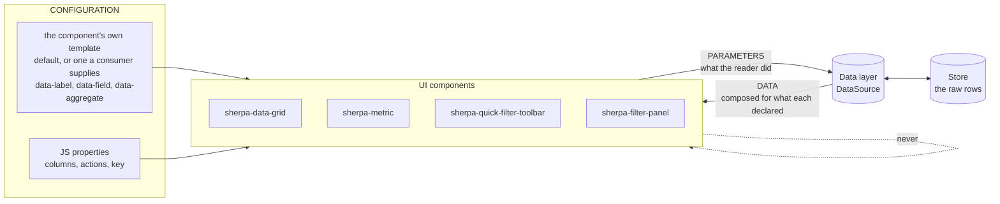

The dotted line is the rule that has been broken: **no component talks to
another.** Today the panel searches the page for a toolbar, reads its shadow
root and takes its menus.

### 9.2 How a component joins — automatic registration

A component must not name its source, or that is the coupling again. It calls
out; the nearest source answers.

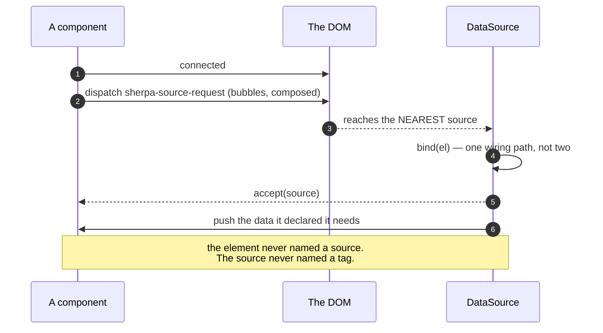

### 9.3 The round trip — a reader changes something

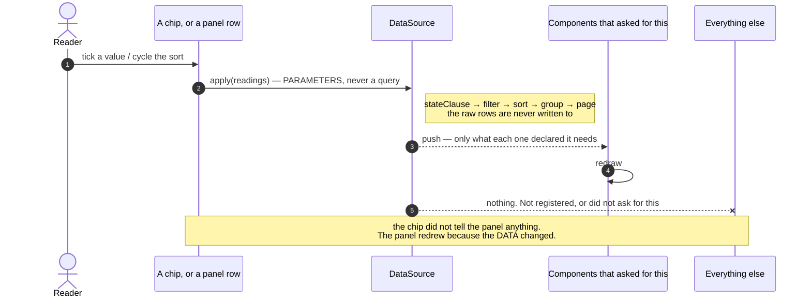

**Only components that asked are pushed to**, and only what they asked for. A
pager never receives rows; a chart bound at `rows: all` is not woken by a page
turn; an element that registered for `values of owner` hears nothing when
`spend` changes.

That is not new — `bind()` already keeps a per-element record and `#push`
writes only that element's shape. What the declaration adds is the third
filter: **which CHANGE is worth a push**. Today every bound element is pushed on
every load.

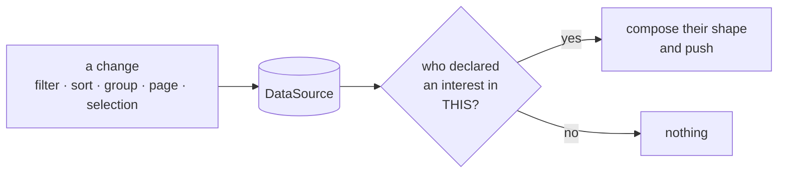

### 9.4 More than one source

Will: *"If we have multiple data sources and stores going on it would be good
if components could specify where to look for a field or value. e.g.
`data-field=dataSource1.sum`"*

A page can hold several sources — customers and invoices, live and saved. The
declaration carries WHERE as well as WHAT:

**A source is PROVIDED OVER A REGION, and named only when a region offers more
than one — see §12.** Where a component is mounted decides what it can reach;
it cannot widen that itself.

| attribute | means |
|---|---|
| *(none)* | the one source this element's region provides |
| `data-source="invoices"` | that region provides two, and this is the one |
| `data-field="spend"` | the field `spend`, in whichever of those applies |

A name is resolvable only inside the region that provides it, so it is a label
on what is already on offer — not a key to every source on the page.

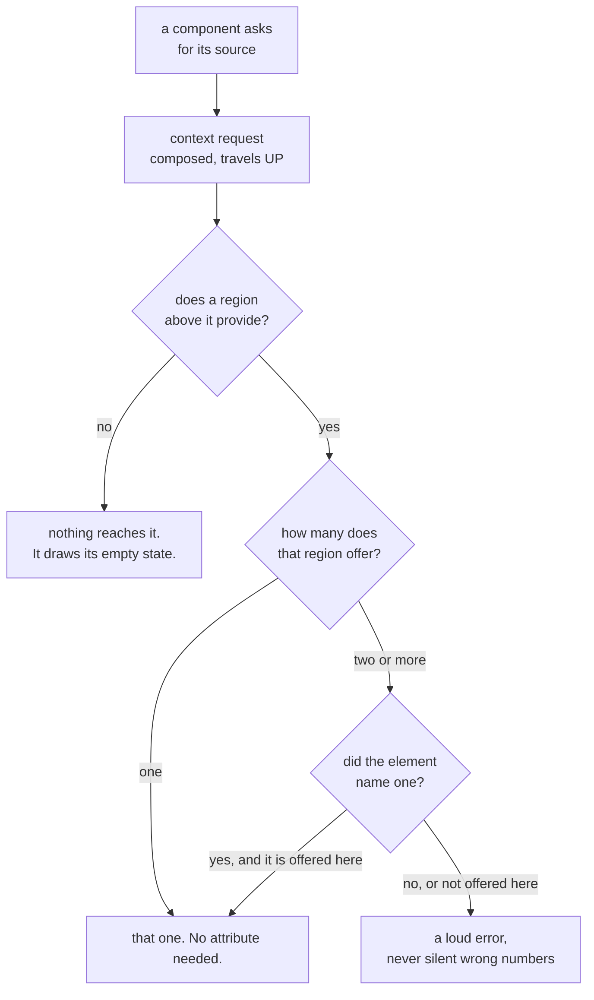

**One caution.** Two sources on one page is also how a field ends up filtered
in two places with no one owner — the bug class this whole review is about. The
scope registry in §9.5 is per source, so `scopeOf('customer')` answers for its
own source only. Crossing sources is the app's business, deliberately.

### 9.5 What a component declares, and what it gets back

The template already carries the declaration. The source does the composing —
with the helpers it already owns, not with a closure the app writes.

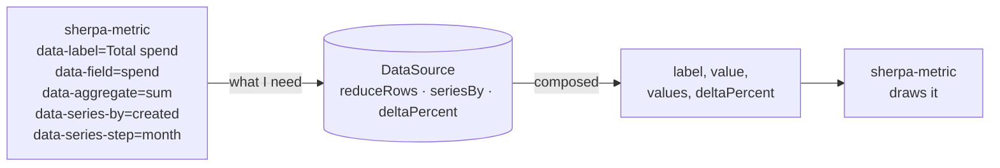

The shapes are a small closed set, not a language:

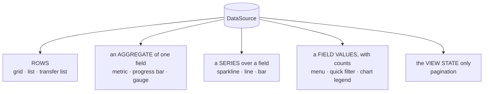

### 9.6 Scope — three meanings, renamed apart

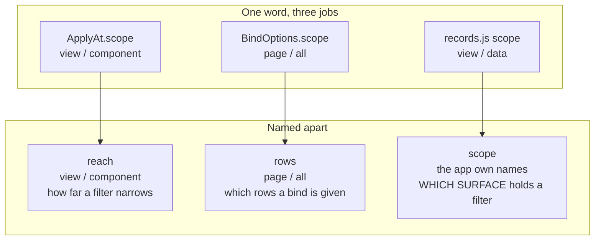

Only the third is what Will's ruling is about, and it is the one with no home
today. It becomes a small registry in the source, holding current state only:

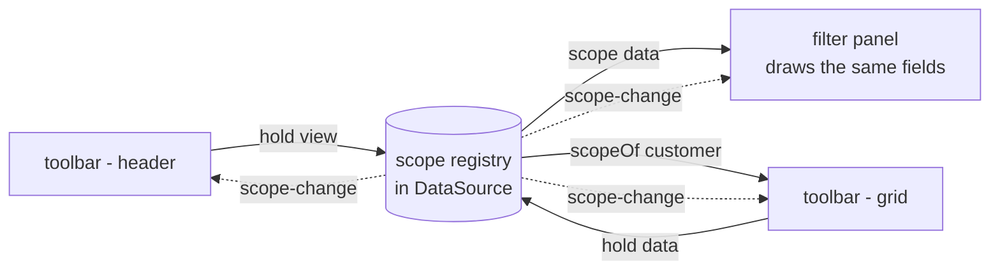

`scopeOf(field)` is what makes **superseding** work without one bar knowing the
other: a field the `view` scope holds is not the `data` bar's to narrow.

### 9.7 The coupling, before and after

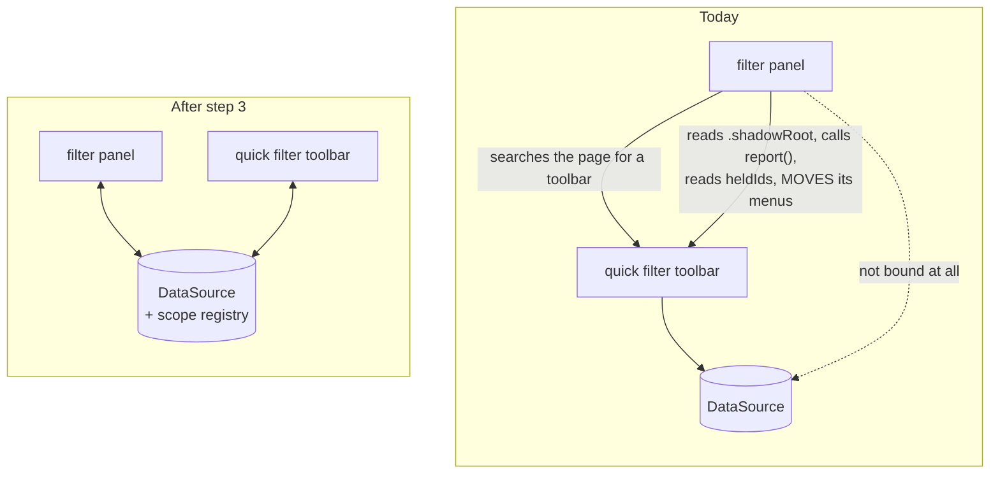

Both components draw their own menus from their own configuration. Borrowing
exists only because the menu held the truth; once the source does, two menus
over one field cannot disagree.

---

## 10. Are we reinventing the platform?

Will asked. Checked against what `src/` already uses.

### Yes — one thing, and it has a name

**The provider request in §9.2 is the Context Protocol.** A community protocol
from the W3C Web Components Community Group: a child dispatches a
`context-request` event carrying a context key and a callback, and the nearest
provider answers. Lit ships it as `@lit/context`.

Shape it the same way rather than inventing `sherpa-source-request`:

```
new ContextRequestEvent(SOURCE_CONTEXT, callback, subscribe?)
```

The `subscribe` flag is already the thing §9.3 needs — "keep telling me", as
against "tell me once". Following the protocol means anyone who has used Lit
context already knows how a sherpa component finds its source, and a non-sherpa
provider could answer too.

**Cost of not following it:** a second, sherpa-only spelling of a pattern the
ecosystem has settled.

### No — the rest is not reinvention

| the idea | the platform's answer | verdict |
|---|---|---|
| configuration on attributes | that is just HTML | not reinvention |
| a component's own template | `<template>`, already used | already right |
| style isolation | `adoptedStyleSheets` — 2 files, shared sheets | already right |
| styling hooks for a host | `part=` — 58 files | already right |
| content injection | `slot` — 122 files | already right |
| floating menus | `popover` + `anchor-name` — 22 and 8 files | already right |
| form participation | `ElementInternals` / `formAssociated` — **1 file** | see below |

**`ElementInternals` is used in one file.** If other inputs re-implement form
participation by hand — name, value, validity, form reset — that is the
platform being reinvented, quietly, per component. Worth its own measurement
when the `sherpa-element` review happens.

`customElements.whenDefined` appears **nowhere**, and that is correct: it
resolves when a CLASS is registered, not when an ELEMENT upgrades. The
`#pendingItems` / `#flushItems` dance solves a different problem — a cloned
element does not upgrade until it enters the document — and there is no
platform call for that. TRAP `T-custom-element-upgrade`.

### Not the platform's job at all

Composing data for a component, the query builder, the scope registry. Nothing
in the platform does these. They are ours to get right.

---

## 11. Where this could be simpler

Without losing anything, and without leaving sherpa's principles.

### 11.1 `bind()` has seven options, and three spell one axis

```ts
interface BindOptions {
  into?; signal?; readonly?; steerOnly?; ignore?; as?; scope?;
}
```

`readonly`, `steerOnly` and `ignore` all answer **which way does this binding
flow**:

| today | means |
|---|---|
| `readonly: true` | it is pushed to, and steers nothing |
| `steerOnly: true` | it steers, and is not pushed to |
| `ignore: ['x']` | it steers, except `x` |

One axis, three spellings — and a caller can set two that disagree. One
property says it:

```ts
flow?: 'both' | 'in' | 'out'      // default 'both'
ignore?: readonly string[]         // the scalpel, unchanged
```

`as` and `into` go with §9.5 (the component declares, the source composes).
`scope` is renamed `rows` in step 3. **Seven options become three.**

### 11.2 The toolbar answers the same question ten ways

```
active · values · superseded · pickedValues · clauses ·
readings · states · customFilters · offering · heldIds
```

Ten getters, all "what is this bar holding". They exist because the APP had to
rebuild state the data layer should own — every one grew to answer one host's
question.

Once the source holds the state (step 3), the app asks the source and most of
these have no caller. **`readings` is the one that carries everything**; the
rest are views of it that the source can answer better.

### 11.3 A sort chip carries its state in three attributes

`data-current` (is it running) + `data-direction` (which way) + `data-column`
(what by). Three attributes that must agree, and §4 shows what happens when
they do not.

The platform has a shape for this: **one attribute, one value**. Sorting is
already `asc | desc | '' suspended | absent`, in `sortDirectionAttr()` —
`cycle.ts` had it right. The chip could carry `data-sort="email:desc"` and
derive the rest.

**Caution:** a compound attribute is harder to select on in CSS, and CSS owns
visibility here. Worth doing only if the CSS stays as clear — measure before
committing.

### 11.4 Two components, one builder

The biggest one, already step 4: `#drawField` / `#drawChip` / `#drawSection`
and `#render` / `#addMenu` are the same job, twice, differing by layout
direction and whether values explode into a run.

### 11.5 What NOT to simplify

- **`stateClause` and the query builder.** One door, correct, and tested. Leave
  it alone.
- **The `#pendingItems` upgrade dance.** It looks like ceremony; it is the only
  way to fill a cloned element that has not upgraded.
- **The longhand-then-`@supports` CSS function pattern.** It looks like
  duplication; without it a third of the web renders nothing.

---

## 12. How a component reaches a source

Will asked two things, and they are not the same question:

> *"I wonder if we should require the data source namespace in the
> attributes/properties."* — and then — *"Those costs aren't ideal. We still
> need to be able to scope implementations of sherpa components to specific
> data sources. It's not great if any UI component can access all data
> sources."*

The first is about **naming**. The second is about **containment**. Naming does
not give containment: if a source answers to a name, any element anywhere can
write that name and reach it. A required attribute makes the reach *visible*,
not *bounded*.

### Containment comes from the TREE

A source is **provided over a region**. Elements inside can reach it; elements
outside cannot — not because they are forbidden, but because the request never
gets there.

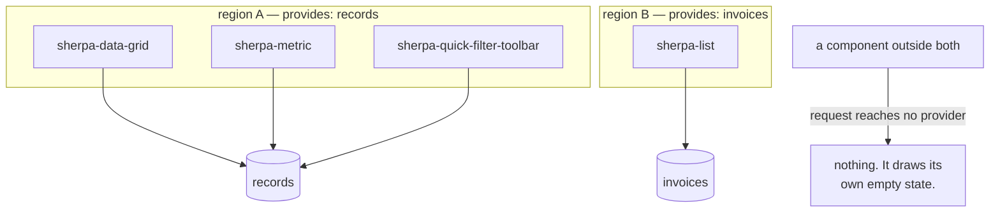

That is the **Context Protocol** from §10, used for what it is for: the request
is `composed`, so it crosses shadow boundaries upward and stops at the first
provider. `closest()` cannot do this — it does not cross shadow roots — which
is precisely why the platform has the event.

**Containment is a property of where the component is mounted**, which is the
app's business and nobody else's. A component cannot widen its own reach.

### Naming is the override, not the rule

Inside one region there is usually **one** source, and then nothing needs
saying:

```html
<!-- region A provides `records` -->
<sherpa-metric data-field="spend" data-aggregate="sum"></sherpa-metric>
```

When a region genuinely provides two, the element says which:

```html
<sherpa-metric data-source="invoices" data-field="total"></sherpa-metric>
```

**And a name is only resolvable inside the region that provides it.** Naming
`invoices` from region A reaches nothing and errors — the name is not a key to
a global registry, it is a label on what this region already offers.

| | costs Will objected to | still true? |
|---|---|---|
| every template gains an attribute | **gone** — only when a region has two sources |
| cannot drop a template in without naming its source | **gone** — it inherits its region |
| renaming a source edits every element | **gone** — the region names it, once |

### Decided — Will, 2026-09-25

> *"We're good if we can specify the data-source attribute on UI components as
> well as data-field."*

**`data-source` is available on every data-bound component, and optional.**

```html
<!-- the region provides one source -->
<sherpa-metric data-field="spend" data-aggregate="sum"></sherpa-metric>

<!-- the region provides two, or you want it said out loud -->
<sherpa-metric data-source="invoices" data-field="total"></sherpa-metric>
```

| | |
|---|---|
| reach | **bounded by the region.** A component cannot widen it |
| one source in a region | `data-source` optional — write it for clarity if you like |
| two or more | the region REFUSES an unnamed request: loud error, never a guess |
| a name the region does not offer | loud error |

`data-source` joins `SHARED_PROPS`, beside `data-bounds` — the same shape, for
the same reason: a named target, resolved by lookup, never inferred.

The loud error comes from resolution failing, not from the attribute being
compulsory. That is what makes it safe to leave optional where it would carry
no information.

### The one thing to watch

A component moved between regions silently changes what it reads. That is the
same trade as CSS inheritance, and the same answer: it is only surprising if
the regions are not visible in the markup. Keep a region a real element with a
real name, never an implicit wrapper.

---

## 13. What this review missed

Asked for honestly. §3 counted **TypeScript only**, which understated the
family by a third and left the tests out altogether.

### 13.1 The real size

| | ts | css | html | total |
|---|---:|---:|---:|---:|
| `sherpa-quick-filter-toolbar` | 1,863 | 268 | 215 | **2,346** |
| `sherpa-menu` | 1,103 | 479 | 295 | **1,877** |
| `sherpa-filter-panel` | 902 | 197 | 138 | **1,237** |
| `sherpa-quick-filter` | 703 | 297 | 109 | **1,109** |
| | | | | **6,569** |

Not 4,561. Every line count in §3 and §7 is a TS count and should be read that
way.

### 13.2 There is more test code than component code

**6,860 lines** across nine spec files for this family, against 6,569 of
component.

`reforged-quick-filter-toolbar.spec.ts` is **2,793 lines** — *bigger than the
1,863-line component it tests*. Inside it, **28 of 40 tests build a toolbar
from scratch by hand**:

```js
const el = document.createElement('sherpa-quick-filter-toolbar');
el.style.cssText = 'inline-size: 1200px';
document.getElementById('root').replaceChildren(el);
await el.rendered;
el.populate([…]);
await window.__settled();
```

Twenty-eight near-identical blocks. A `mountToolbar()` helper exists and two
tests use it. **This is the same disease the components have** — a thing
written many times instead of once — and it has the same cost: a change to how
a toolbar mounts is 28 edits, so it does not get made.

**Worth its own step**, after the component work: one harness per component,
and every test declares only what makes it different. The tests are the one
thing that must keep working while the refactor happens, so they should be
easy to change, not 28-edits-hard.

**Landed at −113, not −400.** `window.__mount(tag, data?, attrs?)` lives in
`test/reforged/harness.html`, and the toolbar spec is 2,799 → 2,600 lines with
all 40 tests green. The remaining mounts across the other specs are NOT
mechanically alike — conditional attributes, hand-built slotted children, a
wrapper div for a width — so rewriting them would be 543 judgement calls, not a
regex. `__mount` is there for them as each is next touched.

One thing it had to learn: it settles only when it populated. Settling an empty
bar gives it two extra frames of layout before its chips arrive, and the fold
test measured the bar mid-flight — 50px in a 48px box.
`T-the-fold-measures-whatever-font-is-loaded` is the same class.

### 13.3 `sherpa-menu` is not the same problem as the toolbar

| | methods | largest method |
|---|---:|---:|
| `sherpa-quick-filter-toolbar` | 77 | **141** (`#addMenu`) |
| `sherpa-menu` | 74 | 59 (`#onToggle`) |

Nearly the same method count, very different shape. The menu is **decomposed**
— its biggest method is a third of the toolbar's. Its size is breadth: it
serves the default, filter and calendar templates, two modes, four row types
and the popover placement, all in one element.

**So it does not want the same treatment.** The toolbar has methods that are
too big; the menu may simply have too many jobs, and the honest question for it
is whether the calendar belongs in a separate element. That is a different
review and should not be folded into this one.

### 13.4 Still unexamined

Named so they are not mistaken for "checked and fine":

- **CSS scoping and inheritance.** 1,241 lines across the four, none of it
  looked at here. Will, 2026-09-24: *"I am REALLY concerned about how this
  framework is structuring the scoping of CSS and its inheritance from tokens
  and base CSS down to component CSS."* That concern is still open and is its
  own review.
- **Accessibility.** Not measured. Roles, focus order through a borrowed menu,
  what a screen reader hears when a filter applies. TODO 24 covers the sweep.
- **Performance.** `#render` rebuilds every chip on every `populate()`, and the
  panel redraws every scope on every draw. Never profiled — it may be fine at
  this size and it is worth knowing before step 4 changes it.
- **The three bugs I could not reproduce.** Compound conditions, group-and-sort
  on reload, and sort appearing on Last Seen. All three needed state I could
  not find. A `source.debugState()` that dumps the whole view state in one
  object would have made them a paste instead of an hour — worth building
  before chasing another.

---

## 14. Error reporting and handling

Will: *"That debugState one is huge. Actually improving error reporting and
handling across the whole system is a great idea."*

### 14.1 What the system says when something is wrong

Measured across `src/`:

| | count |
|---|---:|
| `throw new` | 16 |
| `console.error` | **1** |
| `console.warn` | 3 |
| `catch` blocks | 42, of which **1** swallows |
| silent `if (!x) return;` in the filter family + data layer | **55** |

The one `console.error` is a template that failed to load. The three warnings
are all in `persist-view.ts`. **Everything else fails quietly** — 55 places
where the code gives up and tells nobody.

That is why three of Will's bug reports cost an hour each and were never
reproduced. The system knew something was wrong and had no way to say so.

### 14.2 Not every silent return is a fault

This matters, or the fix becomes noise:

```ts
if (!this.#wideEnough()) return;      // a DECISION. The panel is desktop-only.
if (!held) return;                    // a FAULT. A chip with no state behind it.
```

**The rule: a guard that expresses a decision stays silent; a guard that
expresses a broken assumption reports.** Roughly a third of the 55 are the
second kind — a lookup that found nothing, a menu that should exist, a field
with no definition.

### 14.3 Two precedents already in the codebase

The shapes exist; they are just not used outside the two places that grew them.

**A report carried in the RESULT** — `LoadResult` already does this for rows a
schema refused:

```ts
dropped?: number;
issues?: ReadonlyArray<{ message: string; path?: ReadonlyArray<PropertyKey> }>;
```

**A report handed to a CALLBACK** — `persist-view.ts` already does this:

> *"Called instead of the default `console.warn` when something was skipped."*

One channel, two deliveries: the app reads it, or the app is told. Nothing new
to invent.

### 14.4 `debugState()`

One call that answers "what does the system think is true right now":

```ts
source.debugState()
// {
//   name, rows: 48, total: 100, page: 1, pageSize: 25,
//   sort: [{ field: 'email', direction: 'asc' }], group: 'customer',
//   filter: ['or', […], […]],
//   selections: { owner: { fieldState: 'active', conditions: [...] } },
//   parts: { legend: [...] },
//   scopes: { view: ['customer'], data: ['status','plan'] },
//   bound: [{ tag: 'sherpa-data-grid', rows: 'page', flow: 'both' }, …],
//   issues: [...]
// }
```

A bug report becomes a paste. It is also what a test asserts against instead of
counting rows in the DOM — which is how I mistook a page size of 25 for a
broken filter and reported a bug that did not exist.

**DOM-free**, so it lives with the rest of `sherpa-ui/data` and a node test can
read it.

### 14.5 Woven into the plan

Not a step of its own — it is small at each point and large if left to the end.

| step | what it gains |
|---|---|
| **3** — the data layer coordinates | `debugState()` lands here, because this is where the state arrives. A request that no region answers REPORTS rather than drawing empty. A `data-source` naming something the region does not offer is a loud error (§12). |
| **4** — one field-row builder | the builder reports a definition it cannot draw, instead of returning `null` — that is `#drawField`'s `if (!options.length && !def.menu) return null` today |
| **5** — collapse the sort/group state | a sort naming a column that does not exist says so |
| **new, last** — the sweep | the remaining silent give-ups, judged one at a time against §14.2 |

### 14.6 Rules

1. **A decision is silent. A broken assumption reports.** Never the reverse —
   a warning a reader cannot act on is noise that hides the real one.
2. **Report through ONE channel.** `LoadResult.issues` for anything that came
   back with the data; the callback for anything else. Not `console` directly,
   which an app cannot intercept, silence or route.
3. **`console.warn` is the default, not the mechanism.** As `persist-view`
   already has it: warn unless the app said where else to send it.
4. **A thrown error means the CALLER made a mistake** — `apply: a component
   scope needs a key` is right to throw. A fault in the data or the DOM is
   reported, never thrown: an app should not crash because one chip lost its
   menu.
5. **Every report names the thing.** Field, scope, component, id. "A filter
   could not be drawn" is not a bug report; "field `owner` in scope `data` has
   no definition" is.

---

## 15. Conciseness and reuse

Will: *"Let's also ensure code conciseness, and reuse, is part of the plan. We
only want to add new code where absolutely necessary. We should reduce code
where possible."*

This is §6 turned into something enforceable. Over this session the filter work
was **+4,351 −1,095 — a ratio of 4:1**, and even the commit called a refactor
was +264 −207. Good intentions did not hold; a rule and a gate might.

### 15.1 There is a lot already there to reuse

| | modules | exported names |
|---|---:|---:|
| `src/core/data` | 13 | **131** |
| `src/core/ui` | 6 | 35 |
| `src/core/browser` | 6 | 41 |

**207 exported names**, plus eight shared stylesheets every shadow root already
adopts. When I wrote `#arrange` and `#drawArrangement` into the chip instead of
moving `#cycleSort` and `#toggleGroup` across, `nextSort` and `sortDirectionFrom`
were already sitting in `core/data/cycle.ts` and the new code had to re-learn
what the old code knew.

### 15.2 The rules

1. **Move code; do not rewrite it.** The old version carries its comments, its
   TRAP citations and its guards — all of them paid for by a bug. A rewrite
   re-learns them the same way.
2. **Search `core/` before writing a helper.** 207 names. If the third
   component needs it, it belongs there; if only one does, it stays private.
3. **A step deletes the thing it replaces, in the same commit.** Two paths for
   one job is worse than the old path alone, because now both are half-trusted.
4. **No helper with one caller.** A private method used once is a named
   paragraph; inline it, or find its second caller.
5. **Declare the budget, report the actual.** Every step says its expected net
   change up front and its real one in the commit message. Step 2 said "buys
   ~250 in step 4" and landed at +73; that is fine, and it is only fine because
   it was said out loud.

### 15.3 A gate, in the shape this repo already uses

`lint:css` counts theme-colour reads per component against
`scripts/lint-css-baseline.json`, **which may only FALL** — a component above
its baseline fails, and `--update-baseline` records a drop.

The same shape works for size:

```
npm run check:size                    # every component against its baseline
npm run check:size -- --update-baseline
```

`scripts/size-baseline.json` holds the current count per component file. A file
that GROWS fails and must say why in the commit; one that shrinks updates the
baseline. It is a ratchet, not a limit: no number is "right", but the direction
is.

**Not a line-length or complexity linter.** Those punish clear code. This
counts one thing — did this component get bigger — and makes growth a decision
somebody made on purpose.

**Where it would have helped:** the panel went 0 → 898 lines over this session
with no single commit looking unreasonable.

### 15.4 The budgets

Declared now, so the commits can be judged against them:

| step | expected |
|---|---:|
| 1 — the chip owns its kind | **done: −129 containers, +118 chip** |
| 2 — one derivation of the kind | **done: +73**, buys ~250 in step 4 |
| 3 — the data layer coordinates | **≈ −130** |
| 4 — one field-row builder | **≈ −250** |
| 4b — one set of menu templates | **≈ −60** |
| 5 — collapse sort/group state | **≈ −50** |
| 5.5 — error reporting | **≈ +80**, the one place new code is the point |
| 6 — split `filter-state.ts` | **≈ 0**, a move |
| — the test harness (§13.2) | **≈ −400** |
| | **≈ −800 net** |

If the arc does not land near that, the plan was wrong and should be said to be
wrong rather than quietly exceeded.

---

## 16. Saved custom filters — to explore

Will, 2026-09-25. **Not scheduled.** Recorded here so the shape is known before
step 4 draws the field rows, because two of these change what a "preset" is.

### 16.1 A preset is a conditional, not a boolean

> "The boolean chips in that section of the examples are actually compound
> conditional filters that (potentially) use more than 1 field and those fields
> values."

`has-tickets`, `at-risk` and `unassigned` read as boolean chips — one question,
yes or no. They are not. Each is a **compound condition over one or more
fields**, already written, that the reader only switches on.

So they should carry the **conditional chip styling — the `f(x)` glyph** — and
not the plain toggle look. That is a styling change plus an honest `kind`:
`conditional`, answered by a stored clause rather than by rows.

This lands in `kindOf()` (§2) — a preset is a conditional with its condition
already given — so it is cheap to do while step 4 is open.

### 16.2 A reader turns a condition INTO a chip

> "We should also allow users to convert conditional filters to a boolean chip."

The reverse direction: a reader who has built `status = churned OR risk > 70`
saves it as a chip. Same styling as §16.1, because it is the same thing.

Needs a **menu button on the chip with Edit**, which re-opens the condition UI
— the menu on a bar, the field body in the panel. The UI already exists; what
is missing is the door back into it from a saved chip.

### 16.3 A whole SCOPE becomes one chip

> "We can also allow creating multi-field conditional boolean chips from a whole
> filter scope."

Every field answered in a scope, collapsed into one saved chip. Two open
questions, both listed by Will:

| question | why it is hard |
|---|---|
| what happens to the filter UI | the fields it was built from — cleared, kept, or shown as its contents? |
| how it is edited | a multi-field chip re-opens as a whole scope, not as one menu |

### 16.4 They are SAVED DEFINITIONS, like a view

> "We can think of these as 'saving' custom filter definitions, much like saving
> a view, and add them to the add filters menu under a 'Custom' section at the
> bottom."

That is the framing that makes the rest tractable: a saved custom filter is a
`ViewDefinition` sibling — data, not markup — and the Add menu grows a **Custom
section at the bottom**.

**They cannot transcend a data source.** A clause names fields; another store
may not have them. So a saved definition is scoped to its source, and where it
LIVES is the open question — the same tier question the saved views answered
(`SessionStore` for chrome, a real store for a deliberate save).

### 16.5 What to settle first

1. Is §16.1 just styling plus `kind`, or does a preset need a stored clause in
   its def? (It does — and that clause is what §16.2 writes.)
2. Where a saved definition lives, and how it is keyed to a source.
3. Whether §16.3 clears the fields it was built from. That one is a product
   decision, not an implementation one.

---

## 17. Merge More and Add filter — to explore

Will, 2026-09-25: *"We should merge the overflow 'More' button and the 'Add
filter' button that we use in the filter toolbar into 1 button. They're very
closely aligned and ripe for a merging of their functionality. There's no point
in using twice the amount of space if we don't need to."*

**Not scheduled.** Recorded with what is measured today.

### 17.1 They are already the same control

| | More | Add filter |
|---|---|---|
| element | `<sherpa-quick-filter class="overflow-chip">` | `<sherpa-button class="add-btn">` |
| sits in | the chip run, at its end | the action cluster, after the run |
| its menu lists | the filters that did not FIT | the filters the bar does not HOLD |
| a row does | open that filter's own menu, as a submenu | tick it on, untick it off |
| built by | `#renderFolded()` | `#renderAvailable()` |
| trap | `T-the-more-chip-is-a-door-not-a-filter` | `T-the-add-menu-is-the-whole-list` |

Both are **a menu of filters keyed by id**, drawn beside the run. One lists the
held-but-hidden, the other the holdable-but-not-held. A reader looking for
"where is my Plan filter?" has to know which of the two words means which.

### 17.2 What one button would be

One chip at the end of the run whose menu has **two sections**: the folded
filters (each a door into its own menu) and the offered ones (each a tick).
`sherpa-menu` already draws a divider between reachable and unreachable rows,
so the sectioning exists.

It also answers a question the two have to keep agreeing on: a filter that is
FOLDED is held, so Add must not offer it. That is currently two lists staying
in step by construction.

### 17.3 What to settle first

1. **The badge.** More carries a count of folded filters; Add carries none. One
   button needs one rule for what its badge counts.
2. **`data-current`.** More is active when a folded filter is
   (`T-the-more-chip-is-a-door-not-a-filter`); Add is never active. Merged, "on"
   has to mean one thing.
3. **Where it sits.** In the run it folds with the chips; in the cluster it is
   fixed. It cannot be both, and the fold measurement reads whichever it is.
4. **The empty case.** Nothing folded and nothing to add — does the button go,
   or stay and say so?


---

## 18. A group is a data-layer concept

Will, 2026-09-25, on my step-5 commit message:

> *"Is a group just a sort with no direction? It's also an association of data
> records by a value. I guess sorting by value achieves that in a flat list but
> what if we want to do something with the group as a whole? There's no object
> or single entity to reference, unless I'm mistaken or misinformed."*

He was not misinformed, and the sentence he was reading was wrong as written.
It described two attribute-sync methods; it is not true of the model.

### 18.1 What was there

| layer | what it had |
|---|---|
| `applyOptions` | `group: 'x'` became a LEADING `SortSpec`, direction `asc`, hardcoded. Deliberate — `T-pipeline-order-and-no-grouping` |
| the view | flat rows |
| `sherpa-data-grid` | a `<tr data-group-key>` built while walking them, counted by `rows.filter(...)` over whatever rows it held |
| everything else | nothing. No group could be named, counted or acted on |

`groupRows(rows, field)` and `aggregateBy(...)` already existed in the data
layer. Neither was called by the group feature — only by charts and tests.

### 18.2 What it is now

```
groupSummaries(rows, field) -> { key, value, count }[]      store.ts
DataSource.groups(field?)                                   over MATCHING rows
grid populate({ ..., groups })                              told, not inferred
```

The grid still counts for itself when nobody tells it — that is a grid
populated by hand with no source behind it. It was the default before, which is
why a paged grid's group count was a page count.

### 18.3 The split is paging's

Will: *"It's similar to Paging. There are data pages and data grid visual
pages."*

Exactly. The store counts RECORDS; the grid pages SCREEN LINES and reports that
back (`T-grouped-paging-belongs-to-the-view`, `#viewPages`). Groups divide the
same way, and the words now match: **the data layer says which groups exist and
how big they are; the grid decides which headings fit and which are shut.**

Measured live, grouped by Plan — the source named four groups over 100 records,
the grid drew the one that fitted its page, carrying the source's count:

    told   Enterprise 24 · Free 25 · Pro 24 · Starter 27
    drawn  Enterprise 24   (24 body rows — one visual page)

### 18.4 What this unlocks, unscheduled

Now that a group is an object, these become small rather than impossible:

| | needs |
|---|---|
| a total or average in a group heading | `aggregateBy` per group — both halves exist |
| select or act on a whole group | the keys, which `groups()` gives |
| order the GROUPS, not the rows within them | the hardcoded `direction: 'asc'` in `applyOptions` becomes a parameter |
| a chart or tile that draws the groups | `groups()` is DOM-free, so a server or the MCP can ask too |

---

## 19. Fold aggregation into the data layer — to explore

Will, 2026-09-25: *"We have an aggregate script to collate data for use in data
visualisations. These aggregates are conceptually similar to data pages and
groups. So perhaps we can fold the aggregation code into the data layer to
maximise the reuse of code across paging, grouping, and aggregation."*

**Not scheduled.** Measured, because the overlap turns out to be literal.

### 19.1 The same line, written four times

`src/core/data/aggregate.ts` is 202 lines and nine exports. Both `aggregateBy`
and `seriesBy` open with:

```ts
const groups = new Map(groupRows(rows, field).map((g) => [g.key, g.rows]));
```

`groupRows(rows, …)` appears **four times** inside `core/data` — twice in
`aggregate.ts`, once in `groupSummaries`, once in `applyOptions`'s leading
sort. Four callers, one question.

And `countBy(rows, field)` is `groupSummaries(rows, field)` with a colour index
bolted on. **It is the same computation `DataSource.groups()` now does**, §18,
written a second time and reached a different way.

### 19.2 The three are one question asked three ways

| | asks | who answers today |
|---|---|---|
| paging | *which slice of the matching rows* | the store; the grid re-pages screen lines |
| grouping | *which rows share a value, and how many* | the source, since §18 |
| aggregation | *which rows share a value, and what do they add up to* | **every chart's own adapter** |

The third is the odd one, and it shows: **every chart binds `rows: 'all'`** —
four sites — *because the default bind hands over the PAGE, and a chart
counting 25 of 100 looks perfectly reasonable*
(`T-a-summary-binds-to-all-the-rows`). It asks for every row so it can do the
grouping the source has already done.

### 19.3 What a fold would look like

```ts
source.aggregate(field, kind, valueField?, options?) -> ChartDatum[]
```

Answered from the same matching rows `groups()` counts, so a chart stops
needing `rows: 'all'` and stops carrying an adapter. `GroupSummary` already
holds `count`, which is `reduceRows(rows, 'count')` — the reduction is the
general case of the field it already has.

`AggregateOptions.order` and `includeEmpty` move too. *"The categories, in
order… keep unmentioned categories at zero"* is a GROUPING concern in chart
clothing, and it is the same fact a legend needs
(`T-a-legend-row-goes-inactive-it-never-vanishes`).

### 19.4 What should NOT move

Say it up front, or the fold swallows three things that are genuinely chart
business:

| | why it stays |
|---|---|
| `colorIndex` | presentation. A category's colour is not a property of the data |
| `seriesBy`'s declared POINTS | *"a quiet Tuesday is zero, not absent"* — the point list comes from the axis, not the rows |
| `deltaPercent` | a reading of a drawn series, not of the store |

`bandBy` is the interesting middle: it groups NUMBERS by edges rather than by
value. That is not a different job, it is `groupRows` with a different key
function — which suggests `groupRows(rows, field, keyOf?)` rather than a
separate function.

### 19.5 What to settle first

1. Does `aggregate()` go on `DataSource`, or stay a free function the source
   merely calls? The free function is what an MCP tool and a server already
   import.
2. If charts stop binding `rows: 'all'`, what does the source push them — a
   `ChartDatum[]` part, through the existing `into` mechanism?
3. `bandBy` → `groupRows(rows, field, keyOf)`: one change, two callers.

---

## 20. The active-chip border — parked

Will, 2026-09-25: *"You don't have to do this right now. The rest of the filter
improvements are more important."* Recorded so it is not re-discovered.

`:host([data-current]) :is(.body, .caret)` sets
`border-width: var(--sherpa-border-width-sm, 1px)`, and **that token does not
exist** — the real scale is `--sherpa-display-mode-border-width-*`. So the ON
rule rides on its own literal fallback.

Measured on the `plan` chip, at both pixel densities:

    DPR 1:  off=1px  on=1px
    DPR 2:  off=1px  on=1px

The OFF border binds `--sherpa-border-top`, which resolves to
`--sherpa-display-mode-border-width-sm` = 0.5px, and still measures 1px at 2×.
So something else is widening the off state too, and **the on/off stroke Will
asked for on 2026-09-24 has not been visible**. Not yet explained; the next
look should start from the computed `border-top-width` of `.body` in the off
state and work outwards.

In Figma, `default` and `active` Style modes BOTH bind
`--sherpa-display-mode-border-width-sm`, so the 1px active stroke is a code-side
deviation Will asked for — `--sherpa-display-mode-border-width-base` (1px) is the
token it should name.

---

## 21. One condition system — Default and Custom Condition Filters — to explore

Will, 2026-09-25: *"Default filter modes are also technically conditional
filters. They are either: EQUALS X; EQUALS X AND EQUALS Y… So we can use the same
engine regardless of filtering mode. I think we should do some renaming /
rebranding of the conditional filter mode. We should call it a Custom Condition
Filter. Default is a Default Condition Filter. We use the blue info styling to
represent active Custom Condition Filters. Bringing everything into the same
condition composition system will help us deal with any discrepancies and bugs.
It will make tracking state and type much easier, too."*

**Not scheduled.** Recorded with what is measured today.

### 21.1 The names

| today | becomes |
|---|---|
| the value list — "default" mode, `data-mode="select"` | **Default Condition Filter** |
| the condition rows — "conditional" mode, `data-mode="condition"` | **Custom Condition Filter** |
| `conditions: 'only'` (Email) | a Custom Condition Filter with no Default half |
| the info-blue chip (`T-a-conditioned-chip-reads-as-info`) | an ACTIVE Custom Condition Filter — already the rule |

The rename is wide: across `src` and `examples`, `conditional` appears 42
times, `data-conditional` 21, `data-mode` 18, `'condition'` 25 and
`conditions-only` 10. `kindOf()`'s `'conditional'` kind is one of them.

### 21.2 One correction to carry into it

Two values ticked in ONE field join with **OR**, not AND —
`status: Active, Trial` means *Active OR Trial*. The engine already writes it
that way: `picksClause` gives `['status', 'in', ['Active', 'Trial']]`, which is
`eq Active OR eq Trial`. AND is between fields. So the Default form is:

    EQUALS X                          one pick
    EQUALS X  OR  EQUALS Y  …         several picks in one field

Worth fixing in the words before the rename, because a rename that says AND
will be read as a rule change.

### 21.3 The engine is already half-way there

`stateClause()` is the one query builder (§3) and it already turns BOTH shapes
into the same `Filter` grammar. The split is one level up, in the READING:

| | carried as | built by |
|---|---|---|
| Default | `picked: [x, y]` | `picksClause` → `in` |
| Custom | `conditions: [{ op, picked \| text, join }]` | the or/and-chain in `stateClause` |

So the unification is: **a reading is always `conditions`**, and a Default
reading is the list `[{ op: 'eq', picked: [x] }, { join: 'or', op: 'eq',
picked: [y] }]`. `picked` becomes a derived view of it rather than a second
shape. That removes the class of bug where a control read one shape and wrote
the other — four of the nine filter bugs on 2026-09-24 were a composed field
reading as unanswered for a tick in exactly that hand-off
(`T-a-rebuilt-row-reads-empty-for-a-tick`).

### 21.4 Done — 2026-09-25

The engine and the type landed; see `T-one-condition-system`.

- **One answer shape.** `fieldState()` builds `state.rows` — ticks, a range and
  a typed condition all as rows — and `stateClause` compiles only those,
  through one `rowClause`. The three branches are gone. All 247 existing unit
  tests passed on it before anything else changed.
- **One type.** `state.condition` is `'default' | 'custom' | null`, and BOTH
  the chip's info-blue and its `fx` badge read it. They disagreed before: a
  typed condition in list mode wore `fx` without the blue, and one set at
  startup wore the blue without `fx`.
- **The words.** The menu's mode button and the panel's condition button say
  "Custom condition" / "Default condition".

**Settled, from §21.4's own questions, and how:** `picked` survives as the
input shape — `setChipValues`, the legend and the saved views all speak it —
and `fieldState` turns it into a row. So the saved-view format did not change
at all. And Default and Custom stay two MODES of one menu, over one data shape.

### 21.5 The words — done 2026-09-25

Will: *"rename"*. The public surface speaks Default and Custom now, and the old
names still work. See `T-a-renamed-attribute-keeps-its-old-name`.

| was | is | old name |
|---|---|---|
| menu `data-conditional` | `data-custom` | still read |
| menu `data-conditions-only` | `data-custom-only` | still read |
| menu `data-mode="select" \| "condition"` | `data-mode="default" \| "custom"` | read, and rewritten |
| menu `mode` property, `filter-mode-change` | `'default' \| 'custom'` | the setter takes either |
| chip `data-conditioned` (boolean) | `data-condition="default" \| "custom"` | none — the chip writes it |
| panel `filter-condition-change { conditional }` | `{ mode }`, as the menu's | none — the panel writes it |

**Two bugs found on the way.**

- **A grid column set to "Is not" filtered to what it excluded.** The grid gave
  the data layer its CLAUSE op (`notin`) where a READING op (`ne`) belongs,
  and `notin` came back as `in`. See `T-a-held-clause-op-is-not-a-reading-op`.
  The grid's heading chip now asks `fieldState()` for its condition, so its fx
  and blue follow the toolbar's rule — "Is not" is custom on both.
- **A chip ticked by its def never said `default`.** Its rows stamp after it
  connects, and only the badge was redrawn then. The condition is now written on
  the stamp too.

### 21.5.1 The def — done 2026-09-25

Will: *"B"* — fix the last old words before §16.

| was | is | old spelling |
|---|---|---|
| def `conditions: true \| 'only'` | `custom: true \| 'only'` | still read — `customOf()` |
| kind `'conditional'` | `'custom'` | still believed — `kindOf()` |

`OffersCustom` in `core/ui/filter-kind.ts` declares the key once; the chip,
column, panel and menu defs each declared `conditions` for themselves.

### 21.5.2 Still open

- **"Custom" means two things.** A Custom Condition Filter, and the toolbar's
  host-added chip — `addCustomFilter()`, `customFilters`, `customValue` and a
  private `data-custom` on that chip. §16's saved "Custom" filters would be a
  third.

### 21.6 What was to be settled first

1. Whether `picked` survives as a convenience on the reading, or goes entirely.
   It is the shape `setChipValues`, the legend and the saved views all speak.
2. Whether "Default" and "Custom" are two MODES of one menu, or one list of
   rows where the Default ones happen to be `eq`. The second is simpler and is
   what §21.3 implies.
3. The saved-view format. A `ViewSnapshot` stores readings, so a change of
   shape needs a reader for the old one.

---

## 22. Filter state per View, and a source per View — to explore

Will, 2026-09-25: *"Filters, and their state, is applying to whole Areas of the
app rather than being unique to individual Views within that Area. All Views in
an Area are also using the same Data Source which is unrealistic. So we should
generate more fake data and Data Sources. We should also customise the content
and layouts for all Views, too."*

**Not scheduled.** In the ratified nav words, the "Area" here is a **Context**
(Records — a `?context=`), and its **Views** are the View chip's options: All,
Mine, At risk, Renewals.

### 22.1 What is true today

| | scope today | should be |
|---|---|---|
| filter state (the chips, their picks) | the whole Context — every View shares it | per View |
| the DataSource | ONE per Context — `records.js` builds a single source for every View | one per View, where the View's data differs |
| a View's content and layout | the same grid and charts for every View; a View changes the QUERY only | customised per View |

A View today is a `ViewSnapshot`: a query plus each component's state
(`RECORDS_VIEWS` in `records-views.js`). Switching View re-applies the query
over the SAME source and the SAME screen, so a filter chip set on "Mine" is
still set on "At risk".

### 22.2 What it touches

- **State:** the filter bars' state would be keyed by View, not by Context —
  the saved-view machinery (`persistView`, `ViewSnapshot`) already captures
  "the query AND every component's state", so this may be a keying change
  rather than new machinery.
- **Data:** more fake datasets, and a source per View where the records differ
  — which is also where §7 step 4c's `time` field and §18's groups earn their
  keep, because they must work over any dataset.
- **Content and layout:** a View supplying its own markup is already possible
  (`T-view-content-is-markup`, parsed through an allow-list) — the example
  simply does not use it yet.

### 22.3 What to settle first

1. When a reader switches View and comes back, do they get the View's SAVED
   filters, or the ones they last left there?
2. Does a filter raised to the App header (§7 scope rules) belong to the View,
   or to the Context above every View?
