# The filter family — a review

**Written for Will**, 2026-09-25. Everything here is measured, not estimated;
every command used is given so you can re-run it.

---

---

## Ledger

Kept as the work lands. Budgets from §15.4.

| step | | budget | actual | note |
|---|---|---:|---:|---|
| 1 chip owns its KIND | ✅ | — | −129 / +118 | group and sort own their gesture; 6 methods deleted from the containers |
| 2 one derivation of the kind | ✅ | — | **+73** | 15 inference sites → 1. Buys ~250 in step 4 |
| 3a `scope` renamed three ways | ✅ | ≈ 0 | **+8** | `reach` / `rows` / `scope`. 31 call sites, 2210 tests green |
| 3b the scope registry + `debugState()` | ✅ | ≈ +40 | **+84** | registry +40, `debugState()` +26, docs the rest. 219 unit / 2209 e2e green |
| 3c-i the panel stops REACHING | ✅ | ≈ −60 | **−3** | `#barOf`, `#chipOf`, `#bars`, `#markConditioned` deleted; it reports `readings` |
| 3c-ii stop BORROWING menus | | ≈ −110 | — | the panel draws its own |
| 4 one field-row builder | | ≈ −250 | — | |
| 4b one set of menu templates | | ≈ −60 | — | the range switch is duplicated verbatim |
| 5 collapse sort/group state | | ≈ −50 | — | |
| 5.5 error reporting | | ≈ +80 | — | `debugState()` lands with 3 |
| 6 split `filter-state.ts` | | ≈ 0 | — | |
| test harness §13.2 | | ≈ −400 | — | 28 of 40 toolbar tests mount by hand |
| **arc** | | **≈ −800** | **−3** | code only; docs counted separately |

---

**Diagrams of the target architecture are in §9.** §10 answers "are we
reinventing the platform?", §11 is where this could be simpler, §12 is how a
component reaches a source, and §13 is what this review missed, §14 is error reporting, and §15 is conciseness and reuse — CONTAINED by its region, named only when a region
offers more than one.

## 1. The short version

Four components draw filters: `sherpa-quick-filter` (the chip), its toolbar,
`sherpa-filter-panel`, and `sherpa-menu`. Together they are **4,561 lines of
TypeScript** — and **6,569 lines counting their CSS and HTML**, with **6,860
lines of tests** on top. See §13, which corrects what §3 left out. The data layer under them is correct — I tested it directly and
it answers every question right. **Every filter bug in the last two days came
from two components working out the same answer separately and disagreeing.**

There is a second problem, and it is mine: over this session I added **4,351
lines and deleted 1,095** — a ratio of **4:1**. I have been writing new code
beside the old instead of replacing it. That is a large part of why the surface
keeps growing and why fixes keep reopening old bugs.

---

## 2. What a filter IS

Your taxonomy, 2026-09-25:

> Group is a thing. Sort is a thing. Boolean filters are a thing. Single select
> value filters are a thing. Multi select value filters are a thing. Compound
> Conditional filters are a thing. **Organise is not.** It's just a label on the
> screen.

Six kinds. A heading, a section, a zone, a bar or a panel is **presentation**
and must never name a kind.

**Where the code stands against that model:**

| kind | how it is spelled today | honest? |
|---|---|---|
| group | `data-kind="group"` | ✅ |
| sort | `data-kind="sort"` | ✅ |
| boolean | *no options, and no `kind`* | ❌ inferred |
| single select | `select: 'single'` | ❌ a different axis |
| multi select | `select: 'multiple'` | ❌ a different axis |
| compound conditional | `conditions: true \| 'only'` | ❌ a third axis |

Four of the six kinds are **inferred** from a combination of three unrelated
properties. That is why `#addMenu` is 141 lines: it is a decision tree
rebuilding the kind from its symptoms every time it runs.

---

## 3. The numbers

```
node scripts/…/methods.mjs src/components/<name>/<name>.ts
```

| file | lines | methods | lines in methods |
|---|---:|---:|---:|
| `sherpa-quick-filter-toolbar.ts` | **1,857** | 77 | 1,367 |
| `sherpa-menu.ts` | 1,103 | — | — |
| `sherpa-filter-panel.ts` | **898** | 44 | 638 |
| `sherpa-quick-filter.ts` | 703 | — | — |

The five largest methods in the two containers:

| lines | method | what it does |
|---:|---|---|
| 141 | `toolbar #addMenu` | build a field's menu — every kind, every op |
| 109 | `panel #draw` | build every scope |
| 106 | `panel #drawField` | build one field's row |
| 86 | `toolbar #render` | build every chip |
| 54 | `panel #flipCondition` | switch one field into condition mode |

`#addMenu` + `#render` (227 lines) and `#drawField` + `#drawChip` + `#draw`
(251 lines) are **the same job twice**: turn a filter definition into controls.

---

## 4. The intertwining of Group and Sort

You asked about this directly. Sort state is read or written at **61 sites**:

```
grep -rnE "sortField|sortDirection|data-sort-|setSort|resumeSort|clearSort|nextSort|'sort'" …
```

| file | sites |
|---|---:|
| `sherpa-quick-filter-toolbar.ts` | 15 |
| `sherpa-data-grid.ts` | 13 |
| `sherpa-filter-panel.ts` | 9 |
| `data-source.ts` | 8 |
| `sherpa-quick-filter.ts` | 7 |
| `records.js` | 5 |
| `cycle.ts` | 4 |

**One value, seven owners.** And the value is spread over four separate
attributes that must agree: `data-sort-field`, `data-sort-direction`,
`data-current` on the chip, and `data-direction` on the chip. Group has three.

The asymmetries this has already produced:

- `#syncSortLabel` kept the column when the chip went off; `#syncGroupLabel`,
  four methods away, blanked it. Group forgot what Sort remembered.
- `data-direction` is written `'asc'` unconditionally in three places
  (`#renderOrganise`, `#syncSortFromAttrs`, the chip's own cycle), so "which
  way" and "is it running" are carried by different attributes that no single
  function owns.
- Group and Sort share one `.field-values` container in the panel and are both
  `select: 'single'`, so the "untick the siblings" sweep cleared the other one.

**I could not reproduce** the case you hit (group by Customer, refresh, Sort
comes back on Last Seen). Stored state after grouping reads
`{"sort":[],"group":"customer"}` and sort stays off through a reload, in
toolbar and panel mode. That does not mean it is not real — it means the
trigger is a state I have not found, and with seven owners that is unsurprising.
**Collapsing the owners is more likely to fix it than another hunt.**

---

## 5. Why the bugs keep coming back

Every filter bug reported over two days, against its structural cause:

| symptom | cause |
|---|---|
| amber Sort chip | `data-current` written from 26 places; the chip judged itself from a menu it does not own |
| Group off cleared its column | two hosts painted the chip and disagreed |
| Sort off also killed Group | a container swept a run holding two different controls |
| menus dead after leaving the panel | the borrower did not give them back on close |
| conditional chip opened a blank card | the overflow drill moves ROWS; conditions are not rows |
| Add could not remove | the bar's menu listed what was LEFT, not the whole list |
| Email search "did nothing" | a find-in-list box where a filter was expected |

**Not one was in the data layer.** I verified that directly:

```
one row  (eq Dana)      total=25   ["owner","eq","Dana Whitlock"]
two rows OR             total=50   ["or",[eq Dana],[eq Ravi]]
two rows AND            total= 0   ["and",[eq Dana],[eq Ravi]]
three rows OR           total=75   ["or",…,…,…]
```

The query builder is right. Grouping, sorting and filtering are genuinely
centralised, transforms never touch the raw rows, and there is one `stateClause`.
**The whole problem is above it.**

---

## 6. My own failure mode

You said I write new code rather than improving what is there. Measured over
this session, across the four components and the data layer:

```
git log --numstat --since="2 days ago" -- <the filter components>
+4,351  −1,095   ratio 4.0 : 1
```

| file | start | now | net |
|---|---:|---:|---:|
| `sherpa-filter-panel.ts` | 0 | 898 | **+898** |
| `sherpa-quick-filter.ts` | 522 | 703 | +181 |
| `sherpa-quick-filter-toolbar.ts` | 1,748 | 1,857 | +109 |
| `sherpa-menu.ts` | 1,025 | 1,103 | +78 |

Even the commit *called* a refactor was **+264 −207**. When I moved Group and
Sort into the chip I wrote three new methods (`#arrange`, `#arrangeFromMenu`,
`#drawArrangement`) rather than moving `#cycleSort` and `#toggleGroup` across.
The behaviour ended up in one place, which was the point — but the library grew
where it should have shrunk, and the new code had to re-earn the lessons the
old code already carried.

**The rule for the rest of this work: a step that does not delete more than it
adds is not finished.** Every step below states what it deletes.

---

## 7. The plan

Ordered smallest-risk first. Each step is one commit, full suite between.

### Step 1 — `[x]` The chip owns its KIND (done)

Group and Sort own their gesture, draw themselves, report by name. Containers
place them; the panel annotates with `scope`.
**Deleted:** `#toggleGroup`, `#cycleSort`, `#syncSortLabel`, `#syncGroupLabel`
(toolbar); `#organiseClick`, `#organiseField`, `#sortField`, `#sortLive`
(panel). −129 lines from the containers.

### Step 2 — Name all six kinds, and delete the inference

`data-kind` gains `boolean`, `single`, `multi`, `conditional`. The definition
says what a filter IS; `select` and `conditions` stop being read as a
three-axis code.

**Deletes:** the decision tree inside `#addMenu` (≈60 of its 141 lines), the
`hasOwnContent` guess, and the `conditions ? 'only' : true` branch that had to
be widened twice this week.
**Risk:** low — it is a rename plus a lookup table.
**Closes:** the class where a kind is inferred differently in two places.

### Step 3 — The DATA LAYER coordinates; no component knows another exists

*Revised 2026-09-25 after Will's ruling. The earlier version of this step had
the panel ASK the bar — which keeps them coupled and was the wrong answer.*

> Will: "The Panel and Bar should not be aware of each other. This is core to
> sherpa component agnosticism. The data layer is the coordinator. If we need
> to co-ordinate state then perhaps we need to have a state component in the
> data layer that every component in the UI registers with (name, id) and
> gets/sets state from. It would only be the current state that is tracked."

#### How bad the coupling is today

Measured. The panel does not merely read the bar — it searches the page for
one, reaches into its shadow root, calls its methods and **takes its child
elements**:

| site | what it does |
|---|---|
| `#barOf` | `document.querySelectorAll('sherpa-quick-filter-toolbar')` |
| `#chipOf` | `bar.shadowRoot.querySelector('.chip[data-id=…]')` |
| `#bars` → `bar.report()` | calls a method on the other component |
| `#barOf` → `bar.heldIds` | reads the other component's state |
| `#borrow` / `#giveBack` | MOVES the bar's `<sherpa-menu>` into itself, and back |

And **neither component binds to a `DataSource` at all.** The app wires both by
hand today, and the panel closes the gaps by reaching sideways.

#### Two ways to do what Will described

**A — the `DataSource` IS the registry. (Recommended.)**

It already does every part of the description:

| Will's words | what exists |
|---|---|
| components register (name, id) | `source.bind(el, { as, scope, ignore })` |
| gets state | `selection(field)` → the whole `FilterState`; `state`; `rows` |
| sets state | `select`, `apply`, `contribute`, `setSort`, `setGroup` |
| broadcasts | `#push(el)` per bound element, `selection-change` |
| current state only | true today — nothing is historical |

One thing is genuinely missing, and it is the thing the panel reaches for:
**which filters a scope is currently HOLDING.** That is UI state, not data.
Add one slot — `source.held(scope)` / `source.hold(scope, ids)` — and both
components read and write it without either knowing the other exists.

**B — a separate `StateRegistry` in the data layer**, as sketched: components
register by (name, id) and get/set through it.

Cleaner as a concept, but `bind()` already IS registration. Two registries
means every component joins both, and every value has to be reasoned about
twice — the exact failure this whole review is about. **A gets the same result
with no second door.**

`SherpaElement` could carry the registration so a component opts in with one
line rather than the host wiring it. Worth doing — but as its own step, after
the bloat review Will wants of `sherpa-element.ts` itself.

#### The part that matters most: STOP BORROWING MENUS

Both components draw their own menu from the same definitions the app already
gives them both.

Borrowing exists for `T-one-field-one-filter-menu`: one field, one menu, so two
controls cannot disagree. **Move the truth into the data layer and that reason
disappears** — two menus over one field are fine when neither of them is where
the answer lives.

This is also where the bugs are. Twice this week: menus dead after leaving the
panel (`close()` never gave them back), and a borrowed menu breaking every
listener bound on its old host.

#### What changes

1. The panel takes a `DataSource` the same way every other component does.
2. `#picked`, `#clearField`, `#markConditioned`, `#flipCondition` and
   `#syncAnswered` read `selection(field)` and write `select`/`apply`.
3. `held(scope)` / `hold(scope, ids)` replaces `heldIds`, for the Add menus.
4. The panel builds its own menus; `#borrow` and `#giveBack` go.
5. `bar.report()` goes — the source publishes, it is not nudged.

#### What it deletes

| gone | lines |
|---|---:|
| `#barOf`, `#bars`, `#chipOf` | ~25 |
| `#borrow`, `#giveBack`, `menuHome`, `release`, `#missingMenus` | ~60 |
| `#picked`, `#clearField`, `#markConditioned`, `#syncAnswered` | ~30 |
| `#flipCondition` | ~54 |
| **total** | **≈170** |

Plus `held()` and the binding, ≈40 new. **Net ≈ −130.**

**Risk:** medium-high. The panel's Apply / Discard baseline is built on
`#picked`, and its inline menu bodies are the borrowed ones.
**Closes:** five of the seven bug classes in §5, and both borrowing bugs.

#### Decided — Will, 2026-09-25

> 1. Scoping of filters should live in the data layer.
> 2. [Registration is] automatic.

##### First: "scope" already means three things

*Diagram: §9.6.*

The same disease as `kind`. `DataSource` uses the word twice, for unrelated
axes, and the app uses it a third way:

| where | values | what it actually means |
|---|---|---|
| `ApplyAt.scope` | `view` \| `component` | how a filter REACHES: narrow for everyone, or contribute a named part ANDed under the view |
| `BindOptions.scope` | `page` \| `all` | which ROWS a bound element is pushed — the drawn page, or every match |
| `records.js` | `view` \| `data` | WHICH SURFACE a filter lives on — the header bar, the grid's bar, a panel section |

Only the third is what Will's ruling is about, and it is the one with no home.
Naming them apart is part of this step, or the collision will be re-learned:

- `reach` — `view` \| `component`. The query rule. (renamed from `ApplyAt.scope`)
- `rows` — `page` \| `all`. What a bound element is given. (renamed from
  `BindOptions.scope`)
- `scope` — a NAMED place a filter lives. Free-form, the app's own words.

##### The scope registry

`DataSource` gains one small map, holding **current state only**:

```
scope(name)                 → the fields that scope is holding, in order
hold(name, fields)          → set it
holds(name, field)          → is this field held here?
scopeOf(field)              → which scope holds it, or null
```

That answers, without any component knowing another exists:

- the Add menu's whole list — *held here, ticked; offered, not*
- superseding — a field held by `view` is not the `data` bar's to narrow
- which fields the panel draws in which section
- what a saved view restores

A `scope-change` event joins `selection-change`, so a bar that gains or loses a
filter redraws from the source rather than from a sibling.

##### Automatic registration

*Diagram: §9.2.*

A component must not name its source — that is the coupling again. The web
component idiom is a **provider request**: on connect the element dispatches a
composed event, and the nearest `DataSource` in the tree answers it.

```
SherpaElement.onConnect  →  emit('sherpa-source-request', { accept })
DataSource               →  listens on its host region, calls accept(this)
```

The element learns its source without naming one; the source learns the element
without knowing its tag. `bind()` stays for a host that wants to be explicit —
the same element, wired two ways, is a second door, so the request path calls
`bind()` internally rather than duplicating it.

`SherpaElement` is already flagged for its own bloat review. This is ~20 lines
and belongs with that work, not before it.

##### The component DECLARES; the data layer COMPOSES

*Diagrams: §9.1 and §9.5.*

Will, 2026-09-25:

> Any component template can come in with a variety of attributes set that will
> require data composition from the data layer. So this should probably just be
> the mechanism for all UI components. **1 system, 1 implementation.**

Today the app hands `bind()` a closure — `as` — that builds each component's
shape by hand. Measured in `examples/contexts/records.js`:

| | |
|---|---|
| components fed by an `as` closure | **9** |
| lines of composition around them | **~569** |
| data-layer helpers called by hand | `reduceRows` ×5, `countBy` ×5, `deltaPercent` ×3, `seriesBy` ×2, `aggregate` ×1 |

A tile is built like this, in the app:

```js
summary('#m-spend', (rows) =>
  tile('Total spend', money(reduceRows(rows, 'sum', 'spend')),
       overMonths(rows, 'sum', 'spend')));
```

Every one of those helpers is already IN the data layer. The app is reaching in
and doing the layer's job, per component, by hand — and a self-registering
element has nobody to write the closure for it.

**The component says what it needs, in its own attributes**, which is what a
template already carries:

```html
<sherpa-metric data-label="Total spend" data-field="spend"
               data-aggregate="sum" data-series-by="created"
               data-series-step="month"></sherpa-metric>
```

The source reads that and composes `{ label, value, values, deltaPercent }`
itself. No closure, and the same declaration works wherever the template is
dropped.

The shapes are a small closed set, not a language:

| what a component needs | who needs it |
|---|---|
| ROWS | grid, list, transfer list |
| ROWS + its own config | grid (columns, key, actions) |
| an AGGREGATE of one field | metric, progress bar, gauge |
| a SERIES over a field | metric sparkline, line and bar charts |
| the VALUES of a field, with counts | menu, quick filter, chart legend |
| the VIEW STATE only | pagination |

**Configuration is not data.** `columns`, `key` and `actions` travel through
`as` today only because `as` was the one door. They belong on the component,
set once by the app; then `as` has nothing left to carry and goes.

**Deletes:** the `as` and `into` options, `mergeInto`, and the ~569 lines of
per-component composition in the example — replaced by attributes on the
templates and one composer in the source.

**This is a bigger step than the rest of §7** and touches every data-bound
component, not just the filters. It should be its own item once step 3 lands.

### Step 4 — ONE field-row builder

`#drawField` / `#drawChip` / `#drawSection` and `#render` / `#addMenu` differ
by exactly two things: layout **direction**, and whether a field's values
**explode into a run** or stay behind a menu. Two flags, one builder, shared in
`core/ui/`.

**Deletes:** ≈250 lines — the larger half of both containers' drawing code.
**Risk:** high; land 2 and 3 first.
**Closes:** the class where the two containers drift apart visually and
behaviourally.

### Step 4b — ONE set of menu templates, in `sherpa-menu`

Will, 2026-09-25: *"Should filter menus (both default lists and compound
conditional) be defined as reusable HTML templates? Same goes for numerical
menus, numerical range menus, and date-time menus… Perhaps we should keep all
menu templates in the menu component's HTML file. That way we always have a
single source to pull, or base new templates, from."*

Measured — it is already duplicated, and the range switch is **identical bar
the class names**:

```html
<!-- sherpa-quick-filter-toolbar.html -->
<div class="qf-range-row" data-row>
  <sherpa-switch class="qf-range-switch" data-type="simple"></sherpa-switch>
  <span class="qf-row-label">Range</span>
</div>

<!-- sherpa-data-grid.html -->
<div class="head-filter-range" data-row>
  <sherpa-switch class="head-filter-range-switch" data-type="simple"></sherpa-switch>
  <span class="head-filter-range-label">Range</span>
</div>
```

Same three elements, same `data-row`, same switch, same word. Two spellings, so
two sets of CSS to keep in step — 11 rules in the toolbar and 13 in the grid
for menu bodies that are the same controls.

| body | toolbar | grid | menu |
|---|---|---|---|
| value list (check / radio / all) | — | — | ✅ owns it |
| condition rows | — | — | ✅ owns it |
| range switch | `qf-range-tpl` | `head-range-tpl` | — |
| number | `qf-number-tpl` | `head-number-filter-tpl` | — |
| calendar | `qf-calendar-tpl` | `head-date-filter-tpl` | — |

**`sherpa-menu` already owns two of the five** — the value rows and the
condition rows — and nothing else re-implements those. The three that are
duplicated are exactly the three it does not own.

**So: every menu body lives in `sherpa-menu.html`.** A host asks the menu for a
body by kind rather than cloning its own:

```ts
menu.body(kind)   // 'number' | 'date' | 'range-switch' | …
```

The kind vocabulary for this already exists — `kindOf()` from step 2.

**Deletes:** five templates across two hosts, their two class-name vocabularies,
and ~24 CSS rules. The date one may simply be `sherpa-calendar` with
`data-embedded`, which the grid already does — so it may not need a template at
all.

**Why it is worth doing:** the next component that needs a number filter has
somewhere to get one. Today it would write a third copy, and there would be
three spellings of "Range".

**Where it sits:** beside step 4. Step 4 makes one builder for the TypeScript;
this makes one set of templates for the HTML. Same argument, same shape —
**do them together**, because a builder that clones two different templates has
not finished the job.

### Step 5 — Collapse the sort/group state

One owner, one shape. `data-sort-field` + `data-sort-direction` +
`data-current` + `data-direction` become the chip's own state, read back
through a getter, with the source as the only other owner.

**Deletes:** the three unconditional `'asc'` writes, `#syncSortFromAttrs` /
`#syncGroupFromAttrs` (47 lines), and the panel's seeding.
**Closes:** the intertwining in §4 — including, most likely, the bug I could
not reproduce.

### Step 5.5 — Error reporting, woven through

Not a step of its own — see §14.5 for what each step above gains, and §14.6 for
the five rules. `debugState()` lands with step 3, and a closing sweep judges
the remaining silent give-ups one at a time.

### Step 6 — Split `filter-state.ts`

547 lines doing three jobs: the state model and query building; how a filter
reads in words and badges; `bindSelection`. Tidiness, no behaviour change.

---

## 8. Rules for the work

1. **Every step either deletes more than it adds, or names the deletion it buys
   and which step collects it.** State it in the commit message either way.
   (Step 2 is the first: it is net +73, and it buys ~250 lines in step 4,
   because two components cannot share a builder until they agree what a filter
   IS. Writing the rule as an absolute was wrong.) **§15 has the budgets per
   step, the reuse rules, and the gate that would enforce them.**
2. **Move code, do not rewrite it.** The old code carries lessons — comments,
   TRAP citations, guards — that new code has to re-learn through bugs.
3. **Pin the invariant before moving it.** Off-keeps-the-value regressed
   because nothing tested it across kinds. It does now.
4. **Measure on the running page, and read the TOTAL.** A page size of 25 makes
   a working filter look broken; that cost an hour and a false bug report.
5. **One step per commit, full suite between.** Two steps in one commit means a
   failure cannot be bisected.

---

## 9. How the system should work

### 9.1 Two channels, and only two

**Configuration comes from attributes — set on a component's own template, or
as JS properties.** It never travels through the data layer. **Data comes from
the data layer.** It never travels between components.

The template is part of the component, not part of the app: every sherpa
component ships a default `.html`. A consumer may supply their own — hand
written, or from an engine — and it is still that component's template. Item 27
is the door for that.

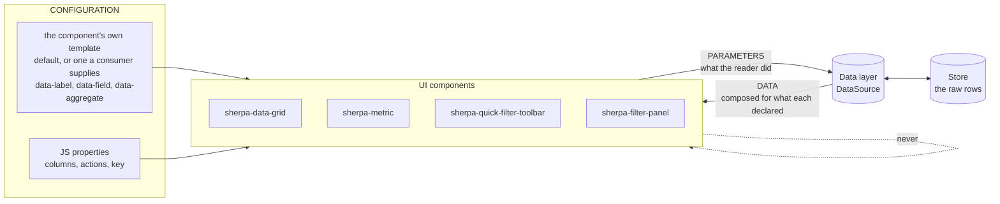

The dotted line is the rule that has been broken: **no component talks to
another.** Today the panel searches the page for a toolbar, reads its shadow
root and takes its menus.

### 9.2 How a component joins — automatic registration

A component must not name its source, or that is the coupling again. It calls
out; the nearest source answers.

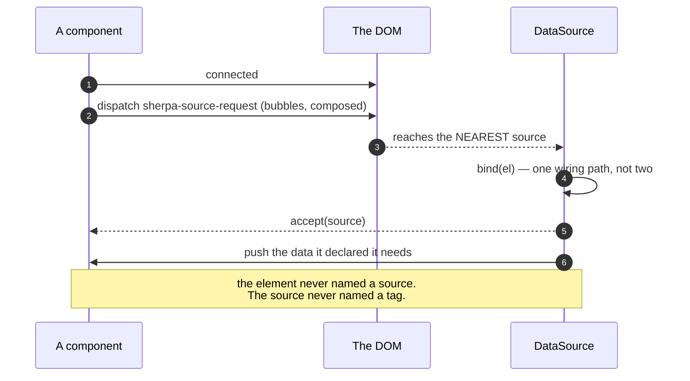

### 9.3 The round trip — a reader changes something

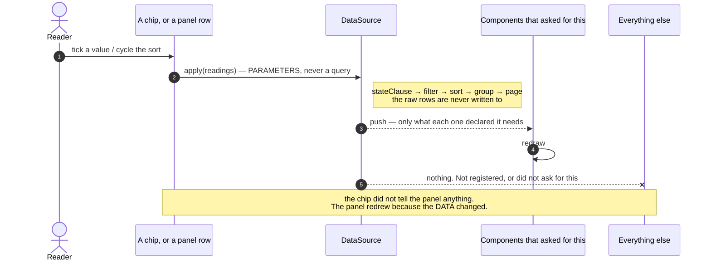

**Only components that asked are pushed to**, and only what they asked for. A
pager never receives rows; a chart bound at `rows: all` is not woken by a page
turn; an element that registered for `values of owner` hears nothing when
`spend` changes.

That is not new — `bind()` already keeps a per-element record and `#push`
writes only that element's shape. What the declaration adds is the third
filter: **which CHANGE is worth a push**. Today every bound element is pushed on
every load.

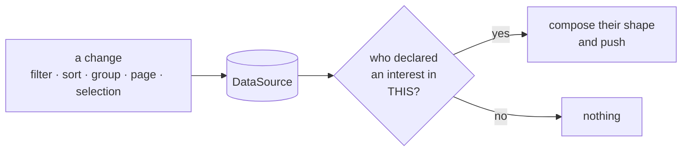

### 9.4 More than one source

Will: *"If we have multiple data sources and stores going on it would be good
if components could specify where to look for a field or value. e.g.
`data-field=dataSource1.sum`"*

A page can hold several sources — customers and invoices, live and saved. The
declaration carries WHERE as well as WHAT:

**A source is PROVIDED OVER A REGION, and named only when a region offers more
than one — see §12.** Where a component is mounted decides what it can reach;
it cannot widen that itself.

| attribute | means |
|---|---|
| *(none)* | the one source this element's region provides |
| `data-source="invoices"` | that region provides two, and this is the one |
| `data-field="spend"` | the field `spend`, in whichever of those applies |

A name is resolvable only inside the region that provides it, so it is a label
on what is already on offer — not a key to every source on the page.

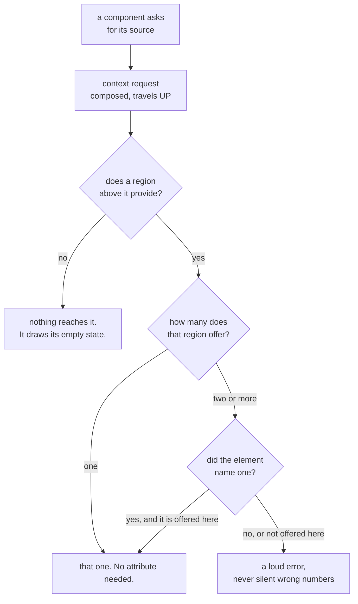

**One caution.** Two sources on one page is also how a field ends up filtered
in two places with no one owner — the bug class this whole review is about. The
scope registry in §9.5 is per source, so `scopeOf('customer')` answers for its
own source only. Crossing sources is the app's business, deliberately.

### 9.5 What a component declares, and what it gets back

The template already carries the declaration. The source does the composing —
with the helpers it already owns, not with a closure the app writes.

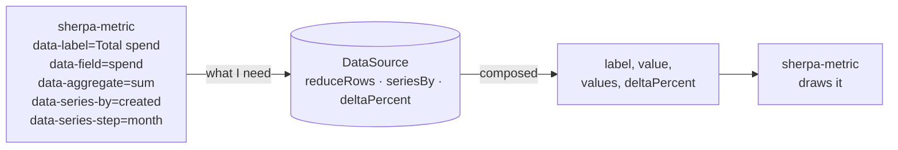

The shapes are a small closed set, not a language:

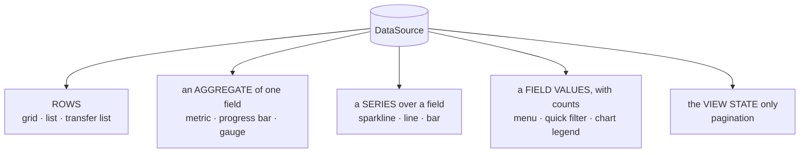

### 9.6 Scope — three meanings, renamed apart

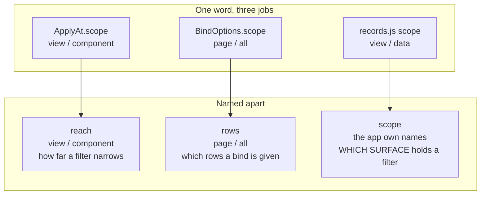

Only the third is what Will's ruling is about, and it is the one with no home
today. It becomes a small registry in the source, holding current state only:

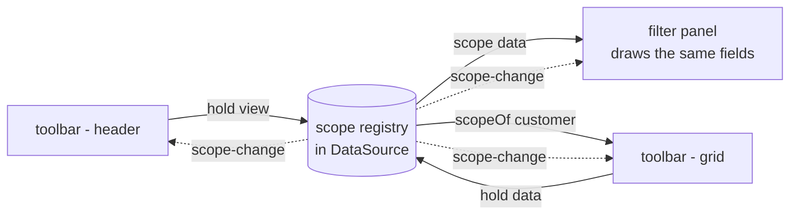

`scopeOf(field)` is what makes **superseding** work without one bar knowing the
other: a field the `view` scope holds is not the `data` bar's to narrow.

### 9.7 The coupling, before and after

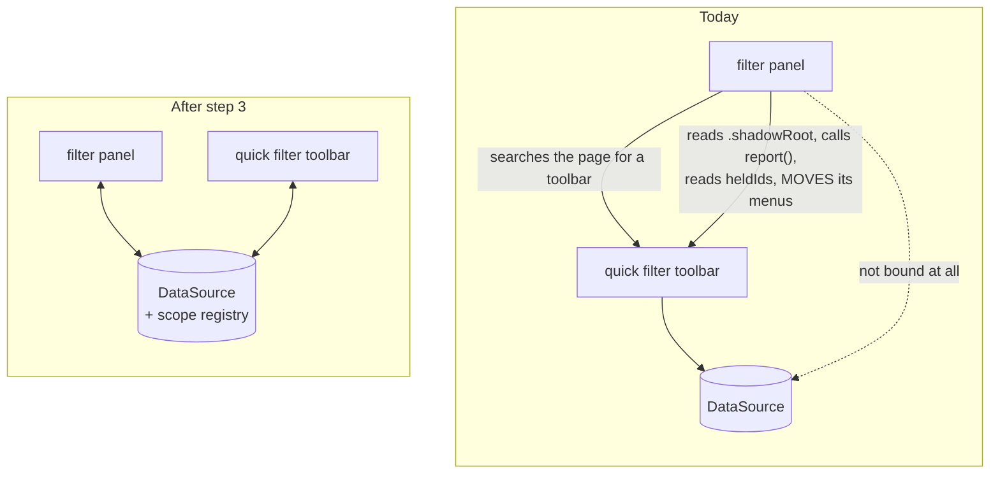

Both components draw their own menus from their own configuration. Borrowing
exists only because the menu held the truth; once the source does, two menus
over one field cannot disagree.

---

## 10. Are we reinventing the platform?

Will asked. Checked against what `src/` already uses.

### Yes — one thing, and it has a name

**The provider request in §9.2 is the Context Protocol.** A community protocol
from the W3C Web Components Community Group: a child dispatches a
`context-request` event carrying a context key and a callback, and the nearest
provider answers. Lit ships it as `@lit/context`.

Shape it the same way rather than inventing `sherpa-source-request`:

```
new ContextRequestEvent(SOURCE_CONTEXT, callback, subscribe?)
```

The `subscribe` flag is already the thing §9.3 needs — "keep telling me", as
against "tell me once". Following the protocol means anyone who has used Lit
context already knows how a sherpa component finds its source, and a non-sherpa
provider could answer too.

**Cost of not following it:** a second, sherpa-only spelling of a pattern the
ecosystem has settled.

### No — the rest is not reinvention

| the idea | the platform's answer | verdict |
|---|---|---|
| configuration on attributes | that is just HTML | not reinvention |
| a component's own template | `<template>`, already used | already right |
| style isolation | `adoptedStyleSheets` — 2 files, shared sheets | already right |
| styling hooks for a host | `part=` — 58 files | already right |
| content injection | `slot` — 122 files | already right |
| floating menus | `popover` + `anchor-name` — 22 and 8 files | already right |
| form participation | `ElementInternals` / `formAssociated` — **1 file** | see below |

**`ElementInternals` is used in one file.** If other inputs re-implement form
participation by hand — name, value, validity, form reset — that is the
platform being reinvented, quietly, per component. Worth its own measurement
when the `sherpa-element` review happens.

`customElements.whenDefined` appears **nowhere**, and that is correct: it
resolves when a CLASS is registered, not when an ELEMENT upgrades. The
`#pendingItems` / `#flushItems` dance solves a different problem — a cloned
element does not upgrade until it enters the document — and there is no
platform call for that. TRAP `T-custom-element-upgrade`.

### Not the platform's job at all

Composing data for a component, the query builder, the scope registry. Nothing
in the platform does these. They are ours to get right.

---

## 11. Where this could be simpler

Without losing anything, and without leaving sherpa's principles.

### 11.1 `bind()` has seven options, and three spell one axis

```ts
interface BindOptions {
  into?; signal?; readonly?; steerOnly?; ignore?; as?; scope?;
}
```

`readonly`, `steerOnly` and `ignore` all answer **which way does this binding
flow**:

| today | means |
|---|---|
| `readonly: true` | it is pushed to, and steers nothing |
| `steerOnly: true` | it steers, and is not pushed to |
| `ignore: ['x']` | it steers, except `x` |

One axis, three spellings — and a caller can set two that disagree. One
property says it:

```ts
flow?: 'both' | 'in' | 'out'      // default 'both'
ignore?: readonly string[]         // the scalpel, unchanged
```

`as` and `into` go with §9.5 (the component declares, the source composes).
`scope` is renamed `rows` in step 3. **Seven options become three.**

### 11.2 The toolbar answers the same question ten ways

```
active · values · superseded · pickedValues · clauses ·
readings · states · customFilters · offering · heldIds
```

Ten getters, all "what is this bar holding". They exist because the APP had to
rebuild state the data layer should own — every one grew to answer one host's
question.

Once the source holds the state (step 3), the app asks the source and most of
these have no caller. **`readings` is the one that carries everything**; the
rest are views of it that the source can answer better.

### 11.3 A sort chip carries its state in three attributes

`data-current` (is it running) + `data-direction` (which way) + `data-column`
(what by). Three attributes that must agree, and §4 shows what happens when
they do not.

The platform has a shape for this: **one attribute, one value**. Sorting is
already `asc | desc | '' suspended | absent`, in `sortDirectionAttr()` —
`cycle.ts` had it right. The chip could carry `data-sort="email:desc"` and
derive the rest.

**Caution:** a compound attribute is harder to select on in CSS, and CSS owns
visibility here. Worth doing only if the CSS stays as clear — measure before
committing.

### 11.4 Two components, one builder

The biggest one, already step 4: `#drawField` / `#drawChip` / `#drawSection`
and `#render` / `#addMenu` are the same job, twice, differing by layout
direction and whether values explode into a run.

### 11.5 What NOT to simplify

- **`stateClause` and the query builder.** One door, correct, and tested. Leave
  it alone.
- **The `#pendingItems` upgrade dance.** It looks like ceremony; it is the only
  way to fill a cloned element that has not upgraded.
- **The longhand-then-`@supports` CSS function pattern.** It looks like
  duplication; without it a third of the web renders nothing.

---

## 12. How a component reaches a source

Will asked two things, and they are not the same question:

> *"I wonder if we should require the data source namespace in the
> attributes/properties."* — and then — *"Those costs aren't ideal. We still
> need to be able to scope implementations of sherpa components to specific
> data sources. It's not great if any UI component can access all data
> sources."*

The first is about **naming**. The second is about **containment**. Naming does
not give containment: if a source answers to a name, any element anywhere can
write that name and reach it. A required attribute makes the reach *visible*,
not *bounded*.

### Containment comes from the TREE

A source is **provided over a region**. Elements inside can reach it; elements
outside cannot — not because they are forbidden, but because the request never
gets there.

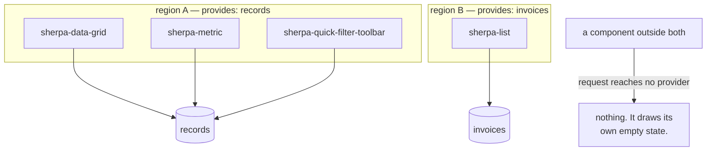

That is the **Context Protocol** from §10, used for what it is for: the request
is `composed`, so it crosses shadow boundaries upward and stops at the first
provider. `closest()` cannot do this — it does not cross shadow roots — which
is precisely why the platform has the event.

**Containment is a property of where the component is mounted**, which is the
app's business and nobody else's. A component cannot widen its own reach.

### Naming is the override, not the rule

Inside one region there is usually **one** source, and then nothing needs
saying:

```html
<!-- region A provides `records` -->
<sherpa-metric data-field="spend" data-aggregate="sum"></sherpa-metric>
```

When a region genuinely provides two, the element says which:

```html
<sherpa-metric data-source="invoices" data-field="total"></sherpa-metric>
```

**And a name is only resolvable inside the region that provides it.** Naming
`invoices` from region A reaches nothing and errors — the name is not a key to
a global registry, it is a label on what this region already offers.

| | costs Will objected to | still true? |
|---|---|---|
| every template gains an attribute | **gone** — only when a region has two sources |
| cannot drop a template in without naming its source | **gone** — it inherits its region |
| renaming a source edits every element | **gone** — the region names it, once |

### Decided — Will, 2026-09-25

> *"We're good if we can specify the data-source attribute on UI components as
> well as data-field."*

**`data-source` is available on every data-bound component, and optional.**

```html
<!-- the region provides one source -->
<sherpa-metric data-field="spend" data-aggregate="sum"></sherpa-metric>

<!-- the region provides two, or you want it said out loud -->
<sherpa-metric data-source="invoices" data-field="total"></sherpa-metric>
```

| | |
|---|---|
| reach | **bounded by the region.** A component cannot widen it |
| one source in a region | `data-source` optional — write it for clarity if you like |
| two or more | the region REFUSES an unnamed request: loud error, never a guess |
| a name the region does not offer | loud error |

`data-source` joins `SHARED_PROPS`, beside `data-bounds` — the same shape, for
the same reason: a named target, resolved by lookup, never inferred.

The loud error comes from resolution failing, not from the attribute being
compulsory. That is what makes it safe to leave optional where it would carry
no information.

### The one thing to watch

A component moved between regions silently changes what it reads. That is the
same trade as CSS inheritance, and the same answer: it is only surprising if
the regions are not visible in the markup. Keep a region a real element with a
real name, never an implicit wrapper.

---

## 13. What this review missed

Asked for honestly. §3 counted **TypeScript only**, which understated the
family by a third and left the tests out altogether.

### 13.1 The real size

| | ts | css | html | total |
|---|---:|---:|---:|---:|
| `sherpa-quick-filter-toolbar` | 1,863 | 268 | 215 | **2,346** |
| `sherpa-menu` | 1,103 | 479 | 295 | **1,877** |
| `sherpa-filter-panel` | 902 | 197 | 138 | **1,237** |
| `sherpa-quick-filter` | 703 | 297 | 109 | **1,109** |
| | | | | **6,569** |

Not 4,561. Every line count in §3 and §7 is a TS count and should be read that
way.

### 13.2 There is more test code than component code

**6,860 lines** across nine spec files for this family, against 6,569 of
component.

`reforged-quick-filter-toolbar.spec.ts` is **2,793 lines** — *bigger than the
1,863-line component it tests*. Inside it, **28 of 40 tests build a toolbar
from scratch by hand**:

```js
const el = document.createElement('sherpa-quick-filter-toolbar');
el.style.cssText = 'inline-size: 1200px';
document.getElementById('root').replaceChildren(el);
await el.rendered;
el.populate([…]);
await window.__settled();
```

Twenty-eight near-identical blocks. A `mountToolbar()` helper exists and two
tests use it. **This is the same disease the components have** — a thing
written many times instead of once — and it has the same cost: a change to how
a toolbar mounts is 28 edits, so it does not get made.

**Worth its own step**, after the component work: one harness per component,
and every test declares only what makes it different. The tests are the one
thing that must keep working while the refactor happens, so they should be
easy to change, not 28-edits-hard.

### 13.3 `sherpa-menu` is not the same problem as the toolbar

| | methods | largest method |
|---|---:|---:|
| `sherpa-quick-filter-toolbar` | 77 | **141** (`#addMenu`) |
| `sherpa-menu` | 74 | 59 (`#onToggle`) |

Nearly the same method count, very different shape. The menu is **decomposed**
— its biggest method is a third of the toolbar's. Its size is breadth: it
serves the default, filter and calendar templates, two modes, four row types
and the popover placement, all in one element.

**So it does not want the same treatment.** The toolbar has methods that are
too big; the menu may simply have too many jobs, and the honest question for it
is whether the calendar belongs in a separate element. That is a different
review and should not be folded into this one.

### 13.4 Still unexamined

Named so they are not mistaken for "checked and fine":

- **CSS scoping and inheritance.** 1,241 lines across the four, none of it
  looked at here. Will, 2026-09-24: *"I am REALLY concerned about how this
  framework is structuring the scoping of CSS and its inheritance from tokens
  and base CSS down to component CSS."* That concern is still open and is its
  own review.
- **Accessibility.** Not measured. Roles, focus order through a borrowed menu,
  what a screen reader hears when a filter applies. TODO 24 covers the sweep.
- **Performance.** `#render` rebuilds every chip on every `populate()`, and the
  panel redraws every scope on every draw. Never profiled — it may be fine at
  this size and it is worth knowing before step 4 changes it.
- **The three bugs I could not reproduce.** Compound conditions, group-and-sort
  on reload, and sort appearing on Last Seen. All three needed state I could
  not find. A `source.debugState()` that dumps the whole view state in one
  object would have made them a paste instead of an hour — worth building
  before chasing another.

---

## 14. Error reporting and handling

Will: *"That debugState one is huge. Actually improving error reporting and
handling across the whole system is a great idea."*

### 14.1 What the system says when something is wrong

Measured across `src/`:

| | count |
|---|---:|
| `throw new` | 16 |
| `console.error` | **1** |
| `console.warn` | 3 |
| `catch` blocks | 42, of which **1** swallows |
| silent `if (!x) return;` in the filter family + data layer | **55** |

The one `console.error` is a template that failed to load. The three warnings
are all in `persist-view.ts`. **Everything else fails quietly** — 55 places
where the code gives up and tells nobody.

That is why three of Will's bug reports cost an hour each and were never
reproduced. The system knew something was wrong and had no way to say so.

### 14.2 Not every silent return is a fault

This matters, or the fix becomes noise:

```ts
if (!this.#wideEnough()) return;      // a DECISION. The panel is desktop-only.
if (!held) return;                    // a FAULT. A chip with no state behind it.
```

**The rule: a guard that expresses a decision stays silent; a guard that
expresses a broken assumption reports.** Roughly a third of the 55 are the
second kind — a lookup that found nothing, a menu that should exist, a field
with no definition.

### 14.3 Two precedents already in the codebase

The shapes exist; they are just not used outside the two places that grew them.

**A report carried in the RESULT** — `LoadResult` already does this for rows a
schema refused:

```ts
dropped?: number;
issues?: ReadonlyArray<{ message: string; path?: ReadonlyArray<PropertyKey> }>;
```

**A report handed to a CALLBACK** — `persist-view.ts` already does this:

> *"Called instead of the default `console.warn` when something was skipped."*

One channel, two deliveries: the app reads it, or the app is told. Nothing new
to invent.

### 14.4 `debugState()`

One call that answers "what does the system think is true right now":

```ts
source.debugState()
// {
//   name, rows: 48, total: 100, page: 1, pageSize: 25,
//   sort: [{ field: 'email', direction: 'asc' }], group: 'customer',
//   filter: ['or', […], […]],
//   selections: { owner: { fieldState: 'active', conditions: [...] } },
//   parts: { legend: [...] },
//   scopes: { view: ['customer'], data: ['status','plan'] },
//   bound: [{ tag: 'sherpa-data-grid', rows: 'page', flow: 'both' }, …],
//   issues: [...]
// }
```

A bug report becomes a paste. It is also what a test asserts against instead of
counting rows in the DOM — which is how I mistook a page size of 25 for a
broken filter and reported a bug that did not exist.

**DOM-free**, so it lives with the rest of `sherpa-ui/data` and a node test can
read it.

### 14.5 Woven into the plan

Not a step of its own — it is small at each point and large if left to the end.

| step | what it gains |
|---|---|
| **3** — the data layer coordinates | `debugState()` lands here, because this is where the state arrives. A request that no region answers REPORTS rather than drawing empty. A `data-source` naming something the region does not offer is a loud error (§12). |
| **4** — one field-row builder | the builder reports a definition it cannot draw, instead of returning `null` — that is `#drawField`'s `if (!options.length && !def.menu) return null` today |
| **5** — collapse the sort/group state | a sort naming a column that does not exist says so |
| **new, last** — the sweep | the remaining silent give-ups, judged one at a time against §14.2 |

### 14.6 Rules

1. **A decision is silent. A broken assumption reports.** Never the reverse —
   a warning a reader cannot act on is noise that hides the real one.
2. **Report through ONE channel.** `LoadResult.issues` for anything that came
   back with the data; the callback for anything else. Not `console` directly,
   which an app cannot intercept, silence or route.
3. **`console.warn` is the default, not the mechanism.** As `persist-view`
   already has it: warn unless the app said where else to send it.
4. **A thrown error means the CALLER made a mistake** — `apply: a component
   scope needs a key` is right to throw. A fault in the data or the DOM is
   reported, never thrown: an app should not crash because one chip lost its
   menu.
5. **Every report names the thing.** Field, scope, component, id. "A filter
   could not be drawn" is not a bug report; "field `owner` in scope `data` has
   no definition" is.

---

## 15. Conciseness and reuse

Will: *"Let's also ensure code conciseness, and reuse, is part of the plan. We
only want to add new code where absolutely necessary. We should reduce code
where possible."*

This is §6 turned into something enforceable. Over this session the filter work
was **+4,351 −1,095 — a ratio of 4:1**, and even the commit called a refactor
was +264 −207. Good intentions did not hold; a rule and a gate might.

### 15.1 There is a lot already there to reuse

| | modules | exported names |
|---|---:|---:|
| `src/core/data` | 13 | **131** |
| `src/core/ui` | 6 | 35 |
| `src/core/browser` | 6 | 41 |

**207 exported names**, plus eight shared stylesheets every shadow root already
adopts. When I wrote `#arrange` and `#drawArrangement` into the chip instead of
moving `#cycleSort` and `#toggleGroup` across, `nextSort` and `sortDirectionFrom`
were already sitting in `core/data/cycle.ts` and the new code had to re-learn
what the old code knew.

### 15.2 The rules

1. **Move code; do not rewrite it.** The old version carries its comments, its
   TRAP citations and its guards — all of them paid for by a bug. A rewrite
   re-learns them the same way.
2. **Search `core/` before writing a helper.** 207 names. If the third
   component needs it, it belongs there; if only one does, it stays private.
3. **A step deletes the thing it replaces, in the same commit.** Two paths for
   one job is worse than the old path alone, because now both are half-trusted.
4. **No helper with one caller.** A private method used once is a named
   paragraph; inline it, or find its second caller.
5. **Declare the budget, report the actual.** Every step says its expected net
   change up front and its real one in the commit message. Step 2 said "buys
   ~250 in step 4" and landed at +73; that is fine, and it is only fine because
   it was said out loud.

### 15.3 A gate, in the shape this repo already uses

`lint:css` counts theme-colour reads per component against
`scripts/lint-css-baseline.json`, **which may only FALL** — a component above
its baseline fails, and `--update-baseline` records a drop.

The same shape works for size:

```
npm run check:size                    # every component against its baseline
npm run check:size -- --update-baseline
```

`scripts/size-baseline.json` holds the current count per component file. A file
that GROWS fails and must say why in the commit; one that shrinks updates the
baseline. It is a ratchet, not a limit: no number is "right", but the direction
is.

**Not a line-length or complexity linter.** Those punish clear code. This
counts one thing — did this component get bigger — and makes growth a decision
somebody made on purpose.

**Where it would have helped:** the panel went 0 → 898 lines over this session
with no single commit looking unreasonable.

### 15.4 The budgets

Declared now, so the commits can be judged against them:

| step | expected |
|---|---:|
| 1 — the chip owns its kind | **done: −129 containers, +118 chip** |
| 2 — one derivation of the kind | **done: +73**, buys ~250 in step 4 |
| 3 — the data layer coordinates | **≈ −130** |
| 4 — one field-row builder | **≈ −250** |
| 4b — one set of menu templates | **≈ −60** |
| 5 — collapse sort/group state | **≈ −50** |
| 5.5 — error reporting | **≈ +80**, the one place new code is the point |
| 6 — split `filter-state.ts` | **≈ 0**, a move |
| — the test harness (§13.2) | **≈ −400** |
| | **≈ −800 net** |

If the arc does not land near that, the plan was wrong and should be said to be
wrong rather than quietly exceeded.
